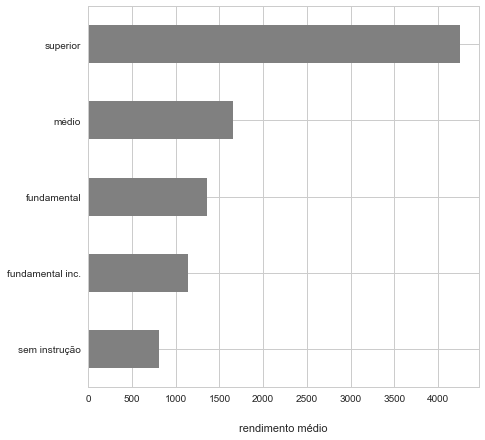
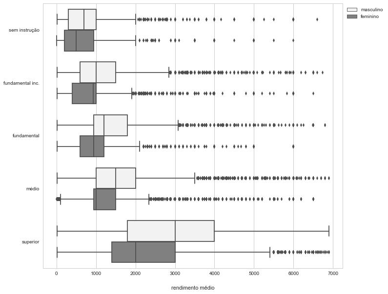
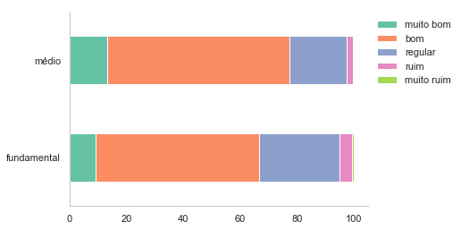
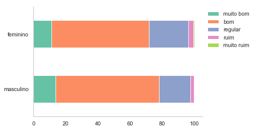
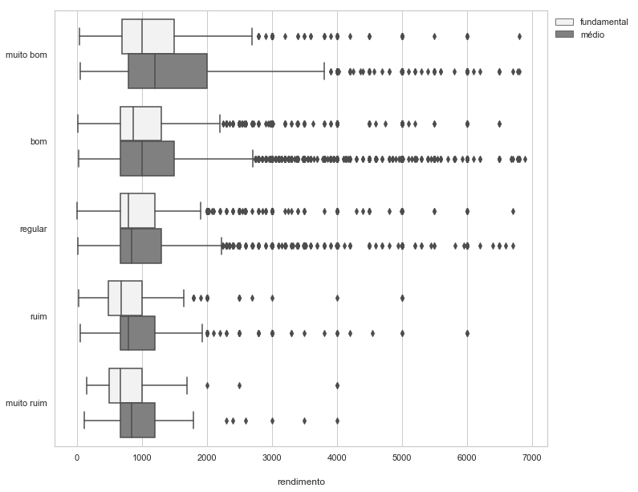

Nesta seção de análises de dados incluirei alguns exemplos de análises com dados reais. </br>

### **Análise exploratória (dados da PNAD)**

**Analisando a relação entre escolaridade e rendimentos**

O exemplo a seguir é de uma análise utilizando dados da Pesquisa Nacional por Amostra de Domicílios (PNAD). Esta análise foi feita para o primeiro artigo da minha dissertação de mestrado. 
</br>
</br>
O endereço onde eu busco os dados é uma pasta do meu computador. Mas caso você tenha interesse em replicar os comandos, o conjunto de dados está disponível <a href="https://drive.google.com/open?id=1atn4LziiMeKyUdfD2uYMEzfljpL3rqRu" target="_blank">aqui.</a>


Importando os pacotes:
```python
In [1]: %matplotlib inline
        import pandas as pd
        import matplotlib.pyplot as plt
        import seaborn as sns
        from openpyxl import load_workbook
        sns.set(style='whitegrid', palette='muted')
```

```python

In [2]: pnad3 = (pd.read_csv('dados/pnad.csv')
                       .query('idade > 17')  # incluir apenas quem já poderia ter concluído o ensino médio
                       .query('freq_esc == 2')) # apenas quem não frequenta mais a escola

        pnad3['sexo'] = pnad3.sexo.astype('category') # transformando em categórica
        pnad3.sexo = pnad3.sexo.cat.rename_categories(['masculino', 'feminino'])

In [3]: pnad3.nivel_instrucao.value_counts()
Out[3]: 2.0    129671
        5.0    106461
        7.0     44608
        1.0     43232
        3.0     32718
        4.0     19527
        6.0      6754

In [4]: pnad3.nivel_instrucao = pnad3.nivel_instrucao.replace([4, 6], [3, 5])
        pnad3['nivel_instrucao'] = pnad3.nivel_instrucao.astype('category')
        pnad3.nivel_instrucao.cat.rename_categories(['sem instrução', 'fundamental inc.',
        'fundamental', 'médio', 'superior'], inplace=True)
        pnad3.nivel_instrucao.cat.as_ordered(inplace=True)

In [5]: pnad3.nivel_instrucao.value_counts()
Out[5]: fundamental inc.    129671
        médio               113215
        fundamental          52245
        superior             44608
        sem instrução        43232

In [6]: pnad4 = pnad3.query('nivel_instrucao == ["fundamental", "médio"]')
        # apenas quem possui ensino fundamental ou médio completo
        pnad4.nivel_instrucao.cat.remove_unused_categories(inplace=True)

In [7]: pnad4.nivel_instrucao.value_counts()
Out[7]: médio          113215
        fundamental     52245

In [8]: nivel = (pnad3.nivel_instrucao.value_counts(normalize=True)*100).round(1)
        nivel = pd.DataFrame(nivel).reset_index().iloc[[4, 0, 2, 1, 3]]
        nivel.columns = ['nível de instrução', '%']
        nivel
Out[8]:  	nível de instrução 	    %
        4 	     sem instrução 	 11.3
        0 	  fundamental inc.	 33.9
        2          fundamental 	 13.6
        1 	             médio 	 29.6
        3 	          superior   11.6
```

</br>

**Ocupações mais comuns (maiores de 17 que não frequentam a escola)**

```python
In [9]: temp = (pnad4.query('nivel_instrucao == "médio"').ocup_cod
                .value_counts(normalize=True)*100).round(1)
        temp = pd.DataFrame(temp).reset_index()
        temp.columns = ['ocup_desc', 'médio']

        temp = (pnad4.query('nivel_instrucao == "médio"').ocup_desc
        .value_counts(normalize=True)*100).round(1)
        temp = pd.DataFrame(temp).reset_index()
        temp.columns = ['ocup_desc', 'médio']

        temp2 = (pnad4.query('nivel_instrucao == "fundamental"').ocup_desc
        .value_counts(normalize=True)*100).round(1)
        temp2 = pd.DataFrame(temp2).reset_index()
        temp2.columns = ['ocup_desc', 'fundamental']

        temp3 = temp.merge(temp2)
        temp3['diferença'] = temp3.fundamental - temp3.médio
In [10]: ocup_fund = temp3.sort_values('fundamental', ascending=False).head(10)
         ocup_fund
Out[10]:                            ocup_desc 	  médio   fundamental 	diferença
        3 	                 trab_serv_domest 	  3.5 	          7.4 	      3.9
        5 	                       agricultor 	  2.3             4.8 	      2.5
        10 	                        pedreiros 	  1.9         	  4.7 	      2.8
        4 	trab_limp_interior_edif_esc_hotel 	  2.6         	  4.0 	      1.4
        0 	                   balc_vend_loja 	  6.8         	  3.8      	 -3.0
        2 	                 comerciante_loja 	  3.7         	  3.6        -0.1
        14 	                     criador_gado 	  1.5         	  3.2 	      1.7
        8 	             cond_caminhão_pesado 	  2.0 	          3.2         1.2
        20 	            trab_element_agricult 	  1.2 	          3.1 	      1.9
        25 	         trab_element_constr_edif 	  0.9 	          2.4 	      1.5

In [11]: ocup_med = temp3.sort_values('médio', ascending=False).head(10)
         ocup_med
Out[11]:  	                        ocup_desc 	médio 	fundamental 	diferença
        0 	                   balc_vend_loja 	  6.8         	3.8 	     -3.0
        1                  escriturario_geral 	  3.9 	        1.0 	     -2.9
        2 	                 comerciante_loja 	  3.7 	        3.6 	     -0.1
        3 	                 trab_serv_domest 	  3.5 	        7.4 	      3.9
        4 	trab_limp_interior_edif_esc_hotel 	  2.6 	        4.0 	      1.4
        5 	                       agricultor 	  2.3 	        4.8 	      2.5
        6 	                       guarda_seg 	  2.2 	        1.8 	     -0.4
        7 	      cond_carro_taxi_caminhonete 	  2.2 	        1.9 	     -0.3
        9 	              caixa_exped_bilhete 	  2.0 	        0.8 	     -1.2
        8 	             cond_caminhão_pesado 	  2.0 	        3.2 	      1.2
```

</br>

**Rendimento médio de acordo com o nível de instrução** </br>
(maiores de 17 que não frequentam a escola)

```python
In [12]: pnad3.groupby('nivel_instrucao').rendimento.mean().plot.barh(color='gray',
         figsize=(7, 7))
         plt.ylabel('')
         plt.xlabel('rendimento médio', labelpad = 20)
         plt.savefig('figuras/rendimento.png', bbox_inches='tight');
Out[12]:
```



```python
In [13]: pnad3.groupby('nivel_instrucao').rendimento.mean().round(0)
Out[13]: nivel_instrucao
         sem instrução        806.0
         fundamental inc.    1141.0
         fundamental         1357.0
         médio               1655.0
         superior            4251.0

```

</br>

**Rendimentos de acordo com o sexo e o nível de instrução** </br>
(maiores de 17 que não frequentam a escola e rendimentos menores do que 7 mil)

```python
In [14]: plt.figure(figsize=(11, 10))
         sns.boxplot('rendimento', 'nivel_instrucao', hue='sexo', color = 'gray',
                     data=pnad3.query('rendimento < 7000'))
         plt.xlabel('rendimento médio', labelpad = 20)
         plt.legend(bbox_to_anchor=(1,1))
         plt.ylabel('')
         plt.savefig('figuras/sexo.png', bbox_inches='tight');
Out[14]:
```


```python
In [15]: pnad3.query('rendimento < 7000').groupby(['nivel_instrucao', 'sexo']).rendimento.median()
Out[15]: nivel_instrucao        sexo     
         sem instrução     masculino     700.0
                            feminino     500.0
         fundamental inc.  masculino    1000.0
                            feminino     930.0
         fundamental       masculino    1200.0
                            feminino     937.0
         médio             masculino    1500.0
                            feminino    1000.0
         superior          masculino    3000.0
                            feminino    2000.0
```

</br>

### **Análise exploratória e análise de regressão**

As análises a seguir se referem aos mesmos dados da análise apresentada anteriormente. A diferença é que agora, além de uma análise exploratória, é feita uma análise a partir de um modelo estatístico (modelo de regressão linear múltipla, nesse caso). </br>
Esta é uma técnica muito conhecida de machine learning.

```python

In [1]: %matplotlib inline
        import pandas as pd
        import numpy as np
        import scipy.stats as stats
        import statsmodels.formula.api as smf
        import statsmodels.api as sms
        from statsmodels.iolib.summary2 import summary_col
        from statsmodels.stats.outliers_influence import variance_inflation_factor
        import matplotlib.pyplot as plt
        import seaborn as sns
        pd.set_option('mode.chained_assignment', None)
        sns.set(style='whitegrid')

In [2]: pnad1 = pd.read_csv('dados/pnad.csv') # pnadc 2tri 2017
        pnad2 = pnad1.query('idade > 17') # apenas quem já poderia ter concluído o ensino médio
        pnad3 = pnad2.query('freq_esc == 2')
        pnad4 = pnad3.query('nivel_instrucao == [3, 5]')
        linha_vazia = pd.DataFrame([np.nan]).T
        pnad_zero = pnad4
        pnad_zero.rendimento = pnad_zero.rendimento.fillna(0)
        # trab. familiares aux., quem recebe em espécie, desocupados, donas de casa, nem nem
        pnad = pnad4.query('rendimento > 0')
        pnad = pnad.assign(rendimento_log=np.log(pnad.rendimento))
In [3]: print(' início: ', pnad1.shape[0], '\n',
        'idade > 17: ', pnad2.shape[0], '\n',
        'não freqenta a escola: ', pnad3.shape[0], '\n',
        'fundamental ou médio: ', pnad4.shape[0], '\n',
        'rendimento > 0: ', pnad.shape[0])
Out[3]:  início:  568313 
         idade > 17:  417664 
         não freqenta a escola:  382971 
         fundamental ou médio:  139179 
         rendimento > 0:  85122

In [4]: df = pnad1.query('idade > 25').nivel_instrucao.value_counts() / pnad1
        .query('idade > 25').shape[0]
In [5]: df[[1, 2, 3, 4]].sum()
Out[5]: 0.5989869557558413

In [6]: pnad.groupby('nivel_instrucao').rendimento.describe(percentiles=[.9, .95, .99])
Out[6]:        
                   count 	     mean 	       std 	 min 	 50% 	 90% 	 95% 	 99% 	   max
nivel_instrucao 									
            3.0  18459.0  1389.439135  1832.573276 	10.0  1100.0  2500.0  3000.0  6000.0  166666.0
            5.0  66663.0  1595.003810  1657.389486 	 4.0  1200.0  3000.0  4000.0  7000.0  100000.0

```

</br>

Para facilitar a visualização, foram retiradas as observações com valores mais altos (1% do ensino médio).

```python
In [7]: ocup_forca = pd.crosstab(pnad_zero.ocup_forca, pnad_zero.nivel_instrucao,
        normalize='columns').round(2) * 100
        ocup_forca.index = ['sim', 'não']
        ocup_forca = pd.concat([linha_vazia, ocup_forca])

        rendimento = (pnad_zero.groupby('nivel_instrucao').rendimento.describe(percentiles=[.5])
        .astype(int).T.iloc[1:, :])
        rendimento.index = ['média', 'desvio padrão', 'mínimo', 'mediana', 'máximo']

        idade = pnad_zero.groupby('nivel_instrucao').idade.describe(percentiles=[.5]).round(1)
        .T.iloc[1:, :]
        idade.index = ['média', 'desvio padrão', 'mínimo', 'mediana', 'máximo']
        idade = pd.concat([linha_vazia, idade])

        sexo = pd.crosstab(pnad_zero.sexo, pnad_zero.nivel_instrucao, normalize='columns')
        .round(2) * 100
        sexo.index = ['masculino', 'feminino']
        sexo = pd.concat([linha_vazia, sexo])

        ocup_pos2 = pd.crosstab(pnad_zero.ocup_pos2, pnad_zero.nivel_instrucao,
                    normalize='columns').round(4) * 100
        ocup_pos2.index = ['empregado s. priv. c/ cart.', 'empregado s. priv. s/ cart.',
                           'trabalhador domest. c/ cart.', 'trabalhadores domest. s/ cart.',
                           'empregado s. pub. c/ cart.', 'empregado s. pub. s/ cart.',
                           'militar e servidor estatutário', 'empregador', 
                           'trabalhador por conta própria', 'trabalhador familiar auxiliar']
        ocup_pos2 = pd.concat([linha_vazia, ocup_pos2])

        resumo1 = (pd.concat([sexo, ocup_forca, ocup_pos2, idade, rendimento], 
                    keys=['Sexo', 'Força de trabalho', 'Posição na ocupação', 'Idade',
                          'Rendimento'])
                   .drop(0, axis=1))
        resumo1.columns = ['Ensino fundamental', 'Ensino médio']
        resumo1
Out[7]:  		                                                Ensino fundamental   Ensino médio
                                                            0                  NaN 	          NaN
                       Sexo   	                    masculino                50.00 	        47.00
                                                     feminino 	             50.00 	        53.00
        	                                                0                  NaN 	          NaN
          Força de trabalho                               sim                66.00 	        75.00
                                                          não 	             34.00 	        25.00
                                                            0 	               NaN     	      NaN
        Posição na ocupação        empregado s. priv. c/ cart.               32.41          42.77
                                   empregado s. priv. s/ cart.               12.55          10.08
                                  trabalhador domest. c/ cart.                3.38           1.58
                                trabalhadores domest. s/ cart.                6.58           3.51
                                    empregado s. pub. c/ cart.                0.48           1.20
                                    empregado s. pub. s/ cart.                1.52           2.79
                                militar e servidor estatutário                3.03           8.22
                                                    empregador                4.21     	     4.31
                                 trabalhador por conta própria               32.10          22.91
                                 trabalhador familiar auxiliar                3.72     	     2.62
                                                             0 	               NaN     	      NaN
                      Idade                              média 	             43.00 	        37.60
                                                 desvio padrão 	             15.50 	        14.30
                                                        mínimo 	             18.00   	    18.00
                                                       mediana 	             42.00 	        35.00
                                                        máximo 	             99.00 	       107.00
                  Rendimento                             média 	            783.00 	       998.00
                                                 desvio padrão 	           1539.00 	      1521.00
                                                        mínimo 	              0.00 	         0.00
                                                       mediana 	            450.00 	       937.00
                                                        máximo 	         166666.00      100000.00
```

```python
In [8]: rendimento = (pnad.groupby('nivel_instrucao').rendimento.describe(percentiles=[.5])
                      .astype(int).T.iloc[1:, :])
        rendimento.index = ['média', 'desvio padrão', 'mínimo', 'mediana', 'máximo']
        
        idade = pnad.groupby('nivel_instrucao').idade.describe(percentiles=[.5]).round(1)
        .T.iloc[1:, :]
        idade.index = ['média', 'desvio padrão', 'mínimo', 'mediana', 'máximo']
        idade = pd.concat([linha_vazia, idade])
        
        sexo = pd.crosstab(pnad.sexo, pnad.nivel_instrucao, normalize='columns')
        .round(2)*100
        sexo.index = ['masculino', 'feminino']
        sexo = pd.concat([linha_vazia, sexo])
        
        ocup_pos2 = pd.crosstab(pnad.ocup_pos2, pnad.nivel_instrucao, normalize='columns')
        .round(2)*100
        ocup_pos2.index = ['empregado s. priv. c/ cart.', 'empregado s. priv. s/ cart.',
                           'trabalhador domest. c/ cart.', 'trabalhadores domest. s/ cart.',
                           'empregado s. pub. c/ cart.', 'empregado s. pub. s/ cart.',
                           'militar e servidor estatutário', 'empregador', 
                           'trabalhador por conta própria']
        ocup_pos2 = pd.concat([linha_vazia, ocup_pos2])
        
        resumo2 = (pd.concat([sexo, ocup_pos2, idade, rendimento], 
                            keys=['Sexo', 'Posição na ocupação', 'Idade', 'Rendimento'])
                           .drop(0, axis=1))
        resumo2.columns = ['Ensino fundamental', 'Ensino médio']
        resumo2

Out[8]:  	                                                    Ensino fundamental    Ensino médio
	                                                        0 	               NaN 	           NaN
                       Sexo                         masculino                 64.0 	          56.0
                                                     feminino 	              36.0 	          44.0
                                                            0 	               NaN 	           NaN
        Posição na ocupação 	  empregado s. priv. c/ cart.                 34.0 	          44.0
                                  empregado s. priv. s/ cart. 	              13.0 	          10.0
                                 trabalhador domest. c/ cart. 	               4.0 	           2.0
                               trabalhadores domest. s/ cart. 	               7.0 	           4.0
                                   empregado s. pub. c/ cart. 	               1.0 	           1.0
                                   empregado s. pub. s/ cart. 	               2.0 	           3.0
                               militar e servidor estatutário 	               3.0 	           8.0
                                                   empregador 	               4.0 	           4.0
                                trabalhador por conta própria 	              33.0 	          24.0
        	                                                0 	               NaN 	           NaN
                      Idade                             média 	              40.7            36.8
                                                desvio padrão 	              12.6	          11.9
                                                       mínimo 	              18.0 	          18.0
                                                      mediana 	              40.0 	          35.0
                                                       máximo 	              88.0 	         107.0
                 Rendimento                             média 	            1389.0 	        1595.0
                                                desvio padrão 	            1832.0 	        1657.0
                                                       mínimo 	              10.0             4.0
                                                      mediana               1100.0 	        1200.0
                                                       máximo 	          166666.0 	      100000.0
        
```

</br>

**Modelos de regressão**

```python
In [9]: modelo1 = smf.ols('rendimento ~ C(nivel_instrucao)', data=pnad).fit(cov_type='HC0')

        modelo2 = smf.ols('rendimento ~ C(nivel_instrucao) + C(sexo)', data=pnad)
        .fit(cov_type='HC0')
        modelo3 = smf.ols('rendimento ~ C(nivel_instrucao) + C(sexo) + idade', data=pnad)
        .fit(cov_type='HC0')
        modelo4 = smf.ols('rendimento ~ C(nivel_instrucao) + C(sexo) + idade + C(tipo_area)
                           + C(uf)', data=pnad).fit(cov_type='HC0')
        modelo5 = smf.ols('rendimento ~ C(nivel_instrucao) + C(sexo) + idade + C(tipo_area)
                           + C(uf)', data=pnad.query('rendimento < 7000'))
                           .fit(cov_type='HC0')
        modelo6 = smf.ols('rendimento ~ C(nivel_instrucao) + C(sexo) + idade + C(tipo_area)
                          + C(uf)', data=pnad_zero.query('rendimento < 7000'))
                          .fit(cov_type='HC0')
        
        lista = [modelo1, modelo2, modelo3, modelo4, modelo5, modelo6]
        strings = ['modelo1', 'modelo2', 'modelo3', 'modelo4', 'modelo5', 'modelo6']
        
        info_dict={'R-squared' : lambda x: "{:.2f}".format(x.rsquared),
                   'No. observations' : lambda x: "{0:d}".format(int(x.nobs))}
        
        tabela = summary_col(results=[modelo1, modelo2, modelo3, modelo4, modelo5, modelo6],
                                      float_format='%0.2f',
                                      model_names=['Modelo 1', 'Modelo 2', 'Modelo 3',
                                      'Modelo 4', 'Modelo 5', 'Modelo 6'],
                                      info_dict=info_dict,
                                      regressor_order=['Intercept', 'C(nivel_instrucao)[T.5.0]',
                                      'C(sexo)[T.2]', 'idade'])
        
        tabela.add_title('Resultados das regressões')
        
        print(tabela)
   
Out[9]:
                           Resultados das regressões
===============================================================================
                          Modelo 1 Modelo 2 Modelo 3 Modelo 4 Modelo 5 Modelo 6
-------------------------------------------------------------------------------
Intercept                 1389.44  1608.27   421.48   593.12   791.65   1022.69 
                          (13.49)  (15.03)  (22.80)  (51.66)  (27.11)   (23.13) 
C(nivel_instrucao)[T.5.0]  205.56   255.81   370.55   390.54   313.08    247.93  
                          (14.94)  (14.73)  (14.89)  (14.84)   (6.96)    (5.75)  
C(sexo)[T.2]                       -605.43  -622.28  -621.16  -491.00   -624.34 
                                   (10.51)  (10.43)  (10.27)   (5.77)    (5.25)  
idade                                         29.31    27.95    19.61      2.91    
                                             (0.56)   (0.56)   (0.28)    (0.19)  
C(tipo_area)[T.2]                                    -119.62   -74.47    -63.21  
                                                     (15.92)   (9.78)    (8.64)  
C(tipo_area)[T.3]                                    -126.08  -113.95    -50.25  
                                                     (46.09)  (29.41)   (25.59) 
C(tipo_area)[T.4]                                    -155.51  -149.21   -113.51 
                                                     (12.81)   (7.57)    (6.56)  
C(uf)[T.12]                                          -232.92  -240.07   -227.61 
                                                     (68.37)  (33.18)   (27.86) 
C(uf)[T.13]                                          -365.92  -383.51   -339.03 
                                                     (76.23)  (29.66)   (24.72) 
C(uf)[T.14]                                          -133.83  -113.02    -90.93  
                                                     (63.89)  (39.65)   (33.37) 
C(uf)[T.15]                                          -295.12  -282.39   -215.17 
                                                     (61.73)  (28.92)   (24.34) 
C(uf)[T.16]                                           163.45   -80.64   -160.69 
                                                    (198.67)  (46.53)   (36.78) 
C(uf)[T.17]                                           -61.94   -98.43   -107.63 
                                                     (69.34)  (34.76)   (29.82) 
C(uf)[T.21]                                          -409.75  -374.65   -339.82 
                                                     (52.39)  (26.70)   (22.64) 
C(uf)[T.22]                                          -344.83  -318.06   -250.81 
                                                     (58.60)  (32.78)   (26.82) 
C(uf)[T.23]                                          -449.65  -386.95   -315.40 
                                                     (50.89)  (27.03)   (22.94) 
C(uf)[T.24]                                          -370.28  -293.35   -256.09 
                                                     (54.58)  (31.85)   (26.62) 
C(uf)[T.25]                                          -383.93  -325.72   -262.32 
                                                     (54.69)  (31.24)   (25.93) 
C(uf)[T.26]                                          -330.66  -307.42   -299.42 
                                                     (54.70)  (28.54)   (23.95) 
C(uf)[T.27]                                          -338.04  -278.53   -304.69 
                                                     (53.66)  (29.07)   (24.28) 
C(uf)[T.28]                                          -212.63  -190.34   -191.11 
                                                     (61.08)  (34.94)   (28.68) 
C(uf)[T.29]                                          -383.05  -354.28   -271.71 
                                                     (53.19)  (27.58)   (23.43) 
C(uf)[T.31]                                           -22.60   -32.14     -1.90   
                                                     (52.30)  (26.35)   (23.04) 
C(uf)[T.32]                                            45.94    29.26     -0.02   
                                                     (55.17)  (28.91)   (25.16) 
C(uf)[T.33]                                           -41.95     2.85    -76.09  
                                                     (51.03)  (26.51)   (23.05) 
C(uf)[T.35]                                           153.48   162.41    120.14  
                                                     (51.56)  (26.19)   (23.02) 
C(uf)[T.41]                                           241.58   219.75    231.28  
                                                     (53.70)  (27.49)   (24.44) 
C(uf)[T.42]                                           410.28   421.08    369.57  
                                                     (52.00)  (26.98)   (24.16) 
C(uf)[T.43]                                           252.37   212.87    208.25  
                                                     (54.35)  (27.77)   (24.58) 
C(uf)[T.50]                                           242.22   182.67    215.63  
                                                     (61.22)  (32.85)   (29.66) 
C(uf)[T.51]                                           197.23   184.80    173.18  
                                                     (57.03)  (31.50)   (28.02) 
C(uf)[T.52]                                           102.61    89.90    120.61  
                                                     (56.47)  (29.78)   (26.31) 
C(uf)[T.53]                                           323.20   183.23    109.22  
                                                    (116.74)  (35.49)   (31.54) 
R-squared                    0.00     0.03     0.08     0.10     0.20      0.15    
No. observations            85122    85122    85122    85122    84147    138204  
===============================================================================
Standard errors in parentheses.             
```

</br>

**Modelo final**
 

Variáveis               | Modelo 1 | Modelo 2 | Modelo 3 | Modelo 4 | Modelo 5 | Modelo 6
----------------------- |----------| -------- | -------- | -------- | -------- | --------
Intercepto              | 1.389,44 | 1.608,27 | 421,48   | 593,12   |  791,65  |1.022,69
                        |  (13,49) | (15,03)  | (22,80)  | (51,66)  | (27,11)  | (23,13)
Nível instrução (médio) | 205,56   | 255,81   | 370,55   | 390,54   | 313,08   | 247,93
                        |(14,94)   | (14,73)  | (14,89)  | (14,84)  | (6,96)   | (5,75)
Sexo (feminino)         |          | -605,43  | -622,28  | -621,16  | -491,00  | -624,34       
                        |          | (10,51)  | (10,43)  | (10,27)  | (5,77)   | (5,25)
Idade                   |          |          | 29,31    | 27,95    | 19,61    | 2,91
                        |          |          | (0,56)   | (0,56)   | (0,28)   | (0,19)
Dummy tipo de área      | não      | não      | não      | sim      | sim      | sim
Dummy UF                | não      | não      | não      | sim      | sim      | sim
R2                      | 0,00     | 0,03     | 0,08     | 0,10     | 0,20     | 0,15 
Nº de observações       | 85.122   | 85.122   | 85.122   | 85.122   | 84.147   | 138.204

Esse modelo final é um resumo do modelo anterior. Ele foi resumido com o intuito de facilitar o entendimento e a visualização dos dados. </br>
A interpretação de cada um dos parâmetros pode ser vista com detalhes na <a href="https://drive.google.com/open?id=1Kql_KAfEerWjGXX89nBWbgDGTVAI5YHd" target="_blank">dissertação.</a> </br>

</br>

### Análise exploratória (dados da PNS)

</br>

Carregando os pacotes:

```python
In [1]: %matplotlib inline
        import pandas as pd
        import numpy as np
        import matplotlib.pyplot as plt
        import statsmodels.formula.api as smf
        plt.style.use('seaborn-whitegrid')
        import seaborn as sns
        
        sns.set(style='whitegrid', palette='Set2')
        
        pd.options.mode.chained_assignment = None

In [2]: pns1 = pd.read_csv('dados/pns.csv') # pns 2013
        pns2 = pns1.query('idade > 17') # apenas quem já poderia ter concluído o ensino médio
        pns3 = pns2.query('freq_esc == 2') # apenas quem não frequenta mais a escola
        pns4 = pns3.query('escolaridade == [3, 5]') # apenas os dois níveis de escolaridade
        linha_vazia = pd.DataFrame([np.nan]).T
        
        pns5 = pns4.query('rendimento > 0') # rendimento maior do que 0
        
        print(' início: ', pns1.shape[0], '\n',
              'idade > 17: ', pns2.shape[0], '\n',
              'não frequenta a escola: ', pns3.shape[0], '\n',
              'fundamental ou médio: ', pns4.shape[0], '\n',
              'rendimento > 0: ', pns5.shape[0])
Out[2]:  início:  205546 
         idade > 17:  145580 
         não frequenta a escola:  129926 
         fundamental ou médio:  51155 
         rendimento > 0:  34479
```

</br>

**Escolaridade da população**

```python
In [3]: pns3.escolaridade = pns3.escolaridade.replace([4, 6], [3, 5]) # incompleto c/ completo
        pns3['escolaridade'] = pns3.escolaridade.astype('category')
        pns3.escolaridade.cat.rename_categories(['sem instrução', 'fundamental inc.',
                                                 'fundamental', 'médio', 'superior'],
        inplace=True)
        pns3.escolaridade.cat.as_ordered(inplace=True)
In [4]: esc = (pns3.escolaridade.value_counts(normalize=True)*100).round(1)
        esc = pd.DataFrame(esc).reset_index().iloc[[2, 1, 3, 0, 4]]
        esc.columns = ['escolaridade', '%']
        esc
Out[4]:  	escolaridade 	       %
        2 	sem instrução 	    16.1
        1 	fundamental inc.    25.1
        3 	fundamental 	    14.2
        0 	médio 	            31.8
        4 	superior 	    12.8
```

</br>

**Analisando apenas quem tem ensino fundamental e/ou médio**
</br>
**Percepção**

```python
In [5]: pns4['percepcao'] = pns4.percepcao.astype('category')
        pns4.percepcao = pns4.percepcao.cat.rename_categories(['muito bom', 'bom', 'regular',
                                                               'ruim', 'muito ruim'])

In [6]: pns4['escolaridade'] = pns4.escolaridade.astype('category')
        pns4.escolaridade = pns4.escolaridade.cat.rename_categories(['fundamental', 'médio'])
In [7]: pns4.percepcao.value_counts(normalize=True)* 100
Out[7]: bom           62.379044
        regular       22.113185
        muito bom     12.305737
        ruim           2.676180
        muito ruim     0.525853
```

</br>

**Percepção de acordo com a escolaridade**

```python
In [8]: percepcao = pd.crosstab(pns4.escolaridade, pns4.percepcao, normalize = 'index').round(3) * 100
        percepcao
Out[8]:    percepcao 	muito bom     bom   regular   ruim     muito ruim
        escolaridade 					
         fundamental 	      9.2    57.3      28.4    4.2            0.9
               médio 	     13.3    64.0      20.0    2.2	      0.4

In [9]: percepcao = percepcao.loc[['fundamental', 'médio'],:]
In [10]: percepcao.plot.barh(stacked=True)
         plt.legend(bbox_to_anchor=(1,1))
         plt.grid(False) # tira as linhas de grade
         sns.despine() # tira os eixos da parte de cima e da direita
         plt.ylabel('');
         plt.savefig('imagens/saude-escolaridade.jpg', bbox_inches = 'tight');
Out[10]:
```


</br>

**Sexo**

```python
In [11]: pns4['sexo'] = pns4.sexo.astype('category')
         pns4.sexo = pns4.sexo.cat.rename_categories(['masculino', 'feminino'])
In [12]: round(pns4.sexo.value_counts(normalize = True) * 100), 2
Out[12]: feminino     53.0
         masculino    47.0
```

</br>

**Percepção de acordo com o sexo**

```python
In [13]: sexo = pd.crosstab(pns4.sexo, pns4.percepcao, normalize = 'index').round(3) * 100
         sexo
Out[13]: percepcao 	muito bom     bom     regular     ruim     muito ruim
         sexo 					
         masculino 	     13.7    64.4 	 19.4 	   2.2 	          0.4
         feminino 	     11.1    60.6 	 24.5 	   3.1 	          0.6

In [14]: sexo.plot.barh(stacked=True)
         plt.legend(bbox_to_anchor=(1,1))
         plt.grid(False) # tira as linhas de grade
         sns.despine() # tira os eixos da parte de cima e da direita
         plt.ylabel('')
         plt.savefig('imagens/saude-sexo.png', bbox_inches='tight');
Out[14]: 
```



</br>

**Escolaridade**

```python
In [15]: pns4.escolaridade.value_counts(normalize = True) * 100
Out[15]: médio          75.210634
         fundamental    24.789366

In [16]: escolaridade2 = pd.crosstab(pns4.escolaridade, pns4.percepcao,
         normalize = 'index').round(2) * 100
         escolaridade2
Out[16]: percepcao 	muito bom     bom     regular     ruim     muito ruim
         escolaridade 					
         fundamental 	      9.0    57.0 	28.0 	   4.0 	          1.0
         médio 	             13.0    64.0 	20.0 	   2.0 	          0.0

In [17]: escolaridade = escolaridade.loc[['muito bom', 'bom', 'regular', 'ruim', 'muito ruim'],:]
```

</br>

**Tabela descritiva**

```python
In [18]: rendimento = (pns4.groupby('escolaridade').rendimento.describe(percentiles=[.5])
                       .astype(int).T.iloc[1:, :])
         rendimento.index = ['média', 'desvio padrão', 'mínimo', 'mediana', 'máximo']
        
         idade = pns4.groupby('escolaridade').idade.describe(percentiles=[.5]).round(1)
                              .T.iloc[1:, :]
         idade.index = ['média', 'desvio padrão', 'mínimo', 'mediana', 'máximo']
         idade = pd.concat([linha_vazia, idade])
        
         sexo = pd.crosstab(pns4.sexo, pns4.escolaridade, normalize='columns')
                .round(2) * 100
         sexo = pd.concat([linha_vazia, sexo])
         sexo = sexo.loc[['masculino', 'feminino']]
        
         percepcao = pd.crosstab(pns4.percepcao, pns4.escolaridade, normalize='columns')
                     .round(3) * 100
         percepcao = pd.concat([linha_vazia, percepcao])
         percepcao = percepcao.loc[['muito bom', 'bom', 'regular', 'ruim', 'muito ruim']]
         percepcao
        
         resumo1 = (pd.concat([sexo, idade, rendimento, percepcao], 
                            keys=['Sexo', 'Idade', 'Rendimento', 'Percepção'])
                           .drop(0, axis=1))
         resumo1.columns = ['Ensino fundamental', 'Ensino médio']
         resumo1
Out[18]:  	                      Ensino fundamental    Ensino médio
         Sexo 	          masculino 	            50.0 	    46.0
                           feminino 	            50.0 	    54.0
         Idade 	              média 	            41.4            37.1
                      desvio padrão 	            15.5 	    13.9
                             mínimo                 18.0 	    18.0
                            mediana 	            40.0 	    34.0
                             máximo 	            99.0 	   105.0
        Rendimento 	      média 	          1169.0 	  1405.0
                      desvio padrão               1786.0 	  1814.0
                             mínimo 	            10.0 	    20.0
                            mediana 	           850.0 	  1000.0
                             máximo             100000.0 	130000.0
         Percepção        muito bom 	             9.2 	    13.3
                                bom 	            57.3 	    64.0
                            regular 	            28.4 	    20.0
                               ruim                  4.2 	     2.2
                         muito ruim 	             0.9 	     0.4
```

</br>

**Rendimento e percepção por escolaridade**

```python
In [19]: plt.figure(figsize=(11, 10))
         sns.boxplot('rendimento', 'percepcao', hue='escolaridade', color = 'gray',
                     data=pns4.query('rendimento < 7000'))
         plt.xlabel('rendimento', labelpad = 20)
         plt.legend(bbox_to_anchor=(1,1))
         plt.ylabel('');
Out[19]:
```



```python
In [20]: pns4.query('rendimento < 7000').groupby(['escolaridade', 'percepcao']).rendimento.median()
Out[20]: escolaridade  percepcao
         3.0           1.0          1000.0
                       2.0           874.0
                       3.0           800.0
                       4.0           689.0
                       5.0           678.0
         5.0           1.0          1200.0
                       2.0          1000.0
                       3.0           850.0
                       4.0           800.0
                       5.0           845.0
```

</br>

### **Análise de regressão**

Nesta seção será apresentada novamente uma análise exploratória de dados. Porém, desta vez, são analisados dados da Pesquisa Nacional de Saúde (PNS) realizada em 2013. </br>

A análise é basicamente uma comparação entre a situação daqueles que possuem o ensino fundamental e aqueles que completaram o ensino médio. </br>

Importando os pacotes:

```python
In [1]: %matplotlib inline
        import pandas as pd
        import numpy as np
        import matplotlib.pyplot as plt
        import statsmodels.formula.api as smf
        import statsmodels.api as sms
        from statsmodels.iolib.summary2 import summary_col
        plt.style.use('seaborn-whitegrid')
        pd.options.mode.chained_assignment = None
```

```python
In [2]: pns1 = pd.read_csv('dados/pns.csv') # pns 2013
        pns2 = pns1.query('idade > 17') # apenas quem já poderia ter concluído o ensino médio
        pns3 = pns2.query('freq_esc == 2') # apenas quem não frequenta mais a escola
        pns4 = pns3.query('escolaridade == [3, 5]') # apenas os dois níveis de escolaridade
        linha_vazia = pd.DataFrame([np.nan]).T
        pns5 = pns4.query('rendimento > 0') # rendimento maior do que 0
        
In [3]: print(' início: ', pns1.shape[0], '\n',
              'idade > 17: ', pns2.shape[0], '\n',
              'não frequenta a escola: ', pns3.shape[0], '\n',
              'fundamental ou médio: ', pns4.shape[0], '\n',
              'rendimento > 0: ', pns5.shape[0])
Out[3]: início:  205546 
        idade > 17:  145580 
        não frequenta a escola:  129926 
        fundamental ou médio:  51155 
        rendimento > 0:  34479
In [4]: pns = pns4
        pns['saude'] = (pns.percepcao <= 2).astype(int) # 1 a 2 = bom, 3 a 5 = ruim 
        pns.doenca_diag = pns.doenca_diag.astype(int).replace(2, 0) # 0 = não
        pns.doenca_hipertensao = pns.doenca_hipertensao.replace([3, 2],[0, np.nan]) # 0 = não
        pns.plano = pns.plano.astype(int).replace(2, 0) # 0 = não
        pns.sexo = pns.sexo.astype(int).replace(2, 0) # 0 = feminino
        pns.fuma = pns.fuma.replace([3, 2], [0, np.nan]) # 0 = não
        pns.exercicio_3meses = pns.exercicio_3meses.replace(2, 0) # 0 = não
        pns.escolaridade = pns.escolaridade.replace([3,5], [0,1]) # 0 = fundamental, 1 = médio
        
In [5]: pns['fumante'] = pns.fuma
        pns['consulta'] = pns.quantidade_consulta_medico
        pns['exercicio'] = pns.exercicio_3meses
          
In [6]: pns['rendimento'] = pns.rendimento/100 # para melhorar a interpretação
```

</br>

**Modelo 1**
```python
In [7]: modelo1 = smf.logit('saude ~ escolaridade + sexo + idade', data=pns).fit()
        modelo1.summary()
Out[7]:                      Logit Regression Results
        Dep. Variable: 	            saude      No. Observations:         51155
                Model: 	            Logit          Df Residuals:         51151
               Method: 	              MLE              Df Model:             3
                 Date: 	 Mon, 18 Mar 2019         Pseudo R-squ.:       0.04849
                 Time: 	         14:50:20        Log-Likelihood:       -27539.
            converged: 	             True               LL-Null:       -28942.
                                                    LLR p-value:         0.000
        	            coef  std err 	  z    P>|z|   [0.025   0.975]
             Intercept 	  1.8379    0.038    48.640    0.000    1.764    1.912
          escolaridade 	  0.4363    0.023    18.803    0.000    0.391    0.482
                  sexo 	  0.3351    0.021    15.814    0.000    0.294    0.377
                 idade 	 -0.0308    0.001   -43.566    0.000   -0.032   -0.029
```

```python
In [8]: np.exp(modelo1.params)
Out[8]: Intercept       6.283112
        escolaridade    1.546914
        sexo            1.398133
        idade           0.969634
```

Interpretação:

* possuir ensino médio aumenta em 55% ((1,55 - 1)) * 100) a chance de o indivíduo se considerar saudável.
* a chance de os homens se considerarem saudáveis é 39% maior em comparação às mulheres.
* um ano a mais de idade diminui em 4% ((0.96 - 1) * 100) a chance de o indivíduo se considerar saudável.

</br>

**Modelo 2**

```python
In [9]: modelo2 = smf.logit('saude ~ escolaridade + sexo + idade + rendimento', data=pns).fit()
        modelo2.summary()
Out[9]:                     Logit Regression Results
        Dep. Variable:             saude       No. Observations:         34479
                Model:             Logit           Df Residuals:         34474
               Method:               MLE               Df Model:             4
                 Date:  Mon, 18 Mar 2019          Pseudo R-squ.:       0.04405
                 Time:          14:50:49         Log-Likelihood:       -17300.
            converged:              True                LL-Null:       -18097.
                                                    LLR p-value:         0.000
                            coef  std err         z    P>|z|   [0.025   0.975]
             Intercept    1.9869    0.054    36.548    0.000    1.880    2.093
          escolaridade    0.3904    0.030    12.850    0.000 	0.331    0.450
                  sexo    0.2575    0.028     9.320    0.000    0.203    0.312
                 idade   -0.0367    0.001   -32.003    0.000   -0.039 	-0.034
            rendimento    0.0193    0.001    13.725    0.000    0.017    0.022
```

```python
In [10]: np.exp(modelo2.params)
Out[10]: Intercept       7.292530
         escolaridade    1.477557
         sexo            1.293717
         idade           0.963980
         rendimento      1.019476
```
Interpretação:

* possuir ensino médio aumenta em 47% a chance de o indivíduo se considerar saudável.
* a chance de os homens se considerarem saudávies é 29% maior em comparação às mulheres.
* cada ano a mais de idade diminui em 4% a chance de ser considerar saudável.
* rendimento: cada 100,00 a mais no rendimento aumenta em 1,93% a chande de ao indivíduo se considerar saudável.

</br>

**Modelo 3**

```python
In [11]: modelo3 = smf.logit('saude ~ escolaridade + sexo + idade + rendimento + plano
                             + fumante + consulta + exercicio', data=pns).fit()
         modelo3.summary()
Out[11]:                      Logit Regression Results 
         Dep. Variable:            saude        No. Observations:         9437
                 Model:            Logit            Df Residuals:         9428
                Method:              MLE                Df Model:            8
                  Date: Mon, 18 Mar 2019           Pseudo R-squ.:      0.09044
                  Time:         14:50:55          Log-Likelihood:      -4917.3
             converged:             True                 LL-Null:      -5406.2
                                                     LLR p-value:   8.660e-206
         	             coef  std err 	  z    P>|z|   [0.025   0.975]
              Intercept    2.0641    0.105   19.700    0.000    1.859    2.269
           escolaridade    0.3318    0.058    5.758    0.000 	0.219 	 0.445
                   sexo    0.1567    0.054    2.917    0.004 	0.051 	 0.262
                  idade   -0.0350    0.002  -16.318    0.000   -0.039 	-0.031
             rendimento    0.0120    0.002    5.007    0.000 	0.007 	 0.017
                  plano    0.7335    0.058   12.579    0.000 	0.619 	 0.848
                fumante   -0.1301    0.081   -1.608    0.108   -0.289 	 0.028
               consulta   -0.1189    0.007  -17.333    0.000   -0.132 	-0.105
              exercicio    0.2625    0.055    4.785    0.000 	0.155 	 0.370
```

```python
In [12]: np.exp(modelo3.params)
Out[12]: Intercept       7.877870
         escolaridade    1.393495
         sexo            1.169688
         idade           0.965561
         rendimento      1.012073
         plano           2.082338
         fumante         0.878035
         consulta        0.887873
         exercicio       1.300166
```

Interpretação:

* possuir o ensino médio aumenta em 39% a chance de o indivíduo se considerar saudável.
* a chance de os homens se considerarem saudáveis é 17% maior em comparação às mulheres.
* um ano a mais de idade diminui em 4% a chance de o indivíduo se considerar saudável.
* cada 100 reais a mais aumenta em 1,21% a chance de se considerar saudável.
* possuir um plano de saúde aumenta em 108% a chance de o indivíduo se considerar saudável.
* uma consulta a mais no médico nos últimos 12 meses diminui em 11% a chance de o indivíduo se considerar saudável.
* ter praticado algum exercício físico nos últimos 3 meses aumenta em 30% a chance de o indivíduo de considerar saudável.

</br>

**Tabela com os três modelos**

```python
In [13]: modelo1 = smf.logit('saude ~ escolaridade + sexo + idade', data=pns).fit()
         modelo2 = smf.logit('saude ~ escolaridade + sexo + idade + rendimento',
         data=pns).fit()
         modelo3 = smf.logit('saude ~ escolaridade + sexo + idade + rendimento + plano
                             + fumante + consulta + exercicio', data=pns).fit()
        
        info_dict = {'Pseudo R-quadrado' : lambda x: "{:.2f}".format(x.prsquared),
                     'Nº de observações' : lambda x: "{0:d}".format(int(x.nobs))}
        
        tabela = summary_col(results = [modelo1, modelo2, modelo3],
                                    float_format='%0.2f',
                                    model_names=['Modelo 1', 'Modelo 2', 'Modelo 3'],
                                    info_dict=info_dict,
                                    regressor_order=['Intercept', 'escolaridade', 'sexo', 
                                                     'idade', 'rendimento', 'plano', 'fumante',
                                                     'consulta', 'exercicio'])
        
        tabela.add_title('Resultados das regressões')
        
        print(tabela)
Out[13]:          Resultados das regressões
         ==========================================
                         Modelo 1 Modelo 2 Modelo 3
         ------------------------------------------
         Intercept           1.84     1.99     2.06    
                           (0.04)   (0.05)   (0.10)  
         escolaridade        0.44     0.39     0.33    
                           (0.02)   (0.03)   (0.06)  
         mulher              0.34     0.26     0.16    
                           (0.02)   (0.03)   (0.05)  
         idade              -0.03    -0.04    -0.04   
                           (0.00)   (0.00)   (0.00)  
         rendimento                   0.02     0.01    
                                    (0.00)   (0.00)  
         plano                                 0.73    
                                             (0.06)  
         fumante                              -0.13   
                                             (0.08)  
         consulta                             -0.12   
                                             (0.01)  
         exercicio                             0.26    
                                             (0.05)  
         Pseudo R-quadrado   0.05    0.04      0.09    
         Nº de observações  51155   34479      9437    
         ==========================================
         Standard errors in parentheses.
```

</br>

**Modelos com outras variáveis resposta** </br>
**Modelo 4**

```python
In [14]: modelo4 = smf.logit('doenca_diag ~ escolaridade + sexo + idade + rendimento
                             + plano + fumante + quantidade_consulta_medico
                             + exercicio_3meses', data=pns).fit()
         modelo4.summary()
Out[14]:  Logit Regression Results
                     Dep. Variable:        doenca_diag  No. Observations:                9437
                             Model:              Logit      Df Residuals:                9428
                            Method:                MLE          Df Model:                   8
                              Date:   Mon, 18 Mar 2019     Pseudo R-squ.:             0.09954
                              Time:           14:51:39    Log-Likelihood:             -3561.3
                         converged:               True           LL-Null:             -3955.0
                                                             LLR p-value:          1.075e-164
                     	                 coef  std err 	       z    P>|z|    [0.025    0.975]
                          Intercept   -4.2622    0.138 	 -30.838    0.000    -4.533    -3.991
                       escolaridade   -0.0576 	 0.072 	  -0.797    0.426    -0.199 	0.084
                               sexo   -0.2466 	 0.065 	  -3.796    0.000    -0.374    -0.119
                              idade    0.0566 	 0.003 	  21.774    0.000     0.051 	0.062
                         rendimento   -0.0012 	 0.002 	  -0.759    0.448    -0.004 	0.002
                              plano    0.0168 	 0.066 	   0.257    0.797    -0.112 	0.145
                            fumante    0.0899 	 0.098 	   0.921    0.357    -0.101 	0.281
         quantidade_consulta_medico    0.0940 	 0.007 	  13.666    0.000     0.081 	0.107
                   exercicio_3meses   -0.0261 	 0.066    -0.396    0.692    -0.156 	0.103
```

```python

In [15]: np.exp(modelo4.params)
Out[15]: Intercept                     0.014091
         escolaridade                  0.944038
         sexo                          0.781452
         idade                         1.058186
         rendimento                    0.998755
         plano                         1.016982
         fumante                       1.094105
         quantidade_consulta_medico    1.098563
         exercicio_3meses              0.974200
```

Interpretação:

* homens têm uma chance 22% menor de serem diagnosticados com alguma doença crônica.
* um ano a mais de idade aumenta em 6% a chance de ser diagnosticado com alguma doença crônica.
* uma cnosulta a mais no médico no último ano aumenta em 9,86% a chance de o indivíduo ser diagnosticado com alguma doença crônica.
* variáveis escolaridade, plano, rendimento, fuma e exercicios_3meses não foram significativas.

</br>

**Modelo 5**

```python
In [16]: modelo5 = smf.logit('doenca_hipertensao ~ escolaridade + sexo + idade
                             + rendimento + plano + fumante + consulta + exercicio',
                             data=pns).fit()
         modelo5.summary()
Out[16]:                          Logit Regression Results 
         Dep. Variable:  doenca_hipertensao  No. Observations:              9136
                 Model:               Logit      Df Residuals:              9127
                Method:                 MLE          Df Model:                 8
                  Date:    Mon, 18 Mar 2019     Pseudo R-squ.:            0.1393
                  Time:            14:52:23    Log-Likelihood:           -3560.1
             converged:                True           LL-Null:           -4136.1
                                                  LLR p-value:        2.127e-243
            	              coef  std err 	    z    P>|z| 	 [0.025   0.975]
              Intercept    -4.8371    0.142   -34.002    0.000   -5.116   -4.558
           escolaridade    -0.1259    0.070    -1.790    0.073   -0.264    0.012
                   sexo    -0.0353    0.064    -0.555    0.579   -0.160    0.089
                  idade     0.0787    0.003    29.169    0.000    0.073    0.084
             rendimento    -0.0029    0.002    -1.699    0.089   -0.006    0.000
                  plano    -0.1396    0.065    -2.132    0.033   -0.268   -0.011
                fumante    -0.0980    0.098    -1.001    0.317   -0.290    0.094
               consulta     0.0606    0.007     8.795    0.000    0.047    0.074
              exercicio    -0.1492    0.066    -2.268    0.023   -0.278   -0.020
```

```python

In [17]: np.exp(modelo5.params)
Out[17]: Intercept       0.007930
         escolaridade    0.881737
         sexo            0.965351
         idade           1.081903
         rendimento      0.997116
         plano           0.869676
         fumante         0.906619
         consulta        1.062449
         exercicio       0.861431
```

Interpretação:

* a variável idade mostra que um ano a mais de idade aumenta em 8% a chance de o indivíduo ser diagnosticado com hipertensão.
* possuir plano de saúde diminui em 13,03% a chance de o indivíduo ser diagnosticado com hipertensão.
* a variável que mostra a quantidade de vezes que a pessoa foi ao médico no último ano mostra que uma ida a mais aumenta em 6% a chance de a pessoa ser diagnosticada com hipertensão.
* por fim, ter feito algum exercício físico nos últimos três meses diminui em 13,86% a chance de o indivíduo ser diagnosticado com hipertensão.
* escolaridade, sexo, rendimento e fumante não foram significativas.

</br>

**Tabela com os resultados dos dois modelos**

```python
In [18]: modelo4 = smf.logit('doenca_diag ~ escolaridade + mulher + idade + rendimento
                             + plano + fumante + consulta + exercicio',
                             data=pns).fit()
         modelo5 = smf.logit('doenca_hipertensao ~ escolaridade + mulher + idade
                             + rendimento + plano + fumante + consulta + exercicio',
                             data=pns).fit()
        
         info_dict={'Pseudo R-quadrado' : lambda x: "{:.2f}".format(x.prsquared),
                    'Nº de observações' : lambda x: "{0:d}".format(int(x.nobs))}
        
         tabela2 = summary_col(results=[modelo4, modelo5],
                                    float_format='%0.2f',
                                    model_names=['Modelo 4', 'Modelo 5'],
                                    info_dict=info_dict,
                                    regressor_order=['Intercept', 'escolaridade', 'mulher',
                                                     'idade','rendimento', 'plano',
                                                     'fumante', 'consulta', 'exercicio'])
        
        tabela.add_title('Resultados das regressões')
        
        print(tabela2)
Out[18]: ==================================
                          Modelo 4 Modelo 5
         ----------------------------------
         Intercept          -4.26    -4.84   
                           (0.14)   (0.14)  
         escolaridade       -0.06    -0.13   
                           (0.07)   (0.07)  
         mulher             -0.25    -0.04   
                           (0.06)   (0.06)  
         idade               0.06     0.08    
                           (0.00)   (0.00)  
         rendimento         -0.00    -0.00   
                           (0.00)   (0.00)  
         plano               0.02    -0.14   
                           (0.07)   (0.07)  
         fumante             0.09    -0.10   
                           (0.10)   (0.10)  
         consulta            0.09     0.06    
                           (0.01)   (0.01)  
         exercicio          -0.03    -0.15   
                           (0.07)   (0.07)  
         Pseudo R-quadrado   0.10     0.14    
         Nº de observações   9437     9136    
         ==================================
         Standard errors in parentheses.
```