## **Excel avançado (versão 2010):**
Aqui veremos algumas funções mais avançadas do Excel, assim como algumas dicas de atalhos que podem ser utilizados e a descrição dos principais erros que podem ocorrer.
Então vamos lá!

 

#### **1. PROCV e PROCH**

Suponha que você tenha uma lista de números de localização do Office e precisa saber quais funcionários estão em cada escritório. A planilha é grande, portanto, você pode pensar que é uma tarefa desafiadora. Na verdade, é muito fácil fazer com uma função proc.

Aqui está um exemplo de como usar PROCV:

``=PROCV(B2,C2:E7,3,VERDADEIRO)``
 
 
- neste exemplo, ``B2`` é o primeiro argumento, que é o valor que você deseja encontrar. Esse argumento pode ser uma referência de célula ou um valor fixo, como "Smith" ou 21.000.  
- o segundo argumento é o intervalo de células, ``C2:E7``, no qual pesquisar o valor que você deseja encontrar.
- o terceiro argumento é a coluna nesse intervalo de células que contém o valor que você busca.  
- por fim, o quarto argumento é opcional. Insira verdadeiro ou falso. Se você inserir ``verdadeiro`` ou deixar o argumento em branco, a função retornará uma correspondência aproximada do valor especificado no primeiro argumento. Se você inserir ``falso``, a função corresponderá ao valor fornecido pelo primeiro argumento. Em outras palavras, deixar o quarto argumento em branco — ou inserir verdadeiro — oferece mais flexibilidade.

Aqui está um exemplo prático:

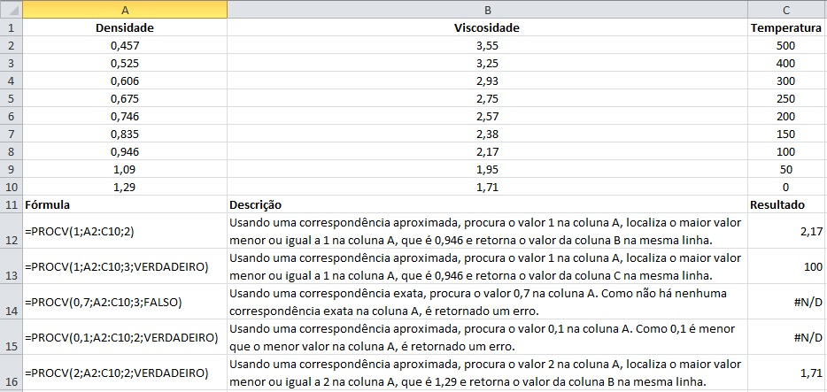

Vamos então para um exemplo de PROCH.

Bom, a função PROCH localiza um valor na linha superior de uma tabela ou matriz de valores e retorna um valor na mesma coluna de uma linha especificada na tabela ou matriz. Você deve usar PROCH quando seus valores de comparação estiverem localizados em uma linha ao longo da parte superior de uma tabela de dados e você quiser observar um número específico de linhas mais abaixo. Quando os valores de comparação estiverem em uma coluna à esquerda dos dados que você deseja localizar, use ``PROCV``.

 

#### **2. Função Índice** 
A função índice é usada para retornar um valor ou a referência a um valor de dentro de uma tabela ou intervalo. Esta função possui duas formas: a matricial e a referencial. Veremos cada uma delas a seguir.

 

**2.1 Matricial**

A forma matricial da função índice retorna o valor de um elemento em uma tabela ou uma matriz, selecionado pelos índices de número de linha e coluna (nesta ordem: primeiro a linha e depois a coluna).

A fórmula possui dois argumentos obrigatórios e um opcional:
- o primeiro argumento é o intervalo de células da constante ou matriz;  
- o segundo é o número da linha (se ficar em branco, o número da coluna deve ser preenchido);  
- o terceiro (opcional) é o número da coluna.

A forma matricial deve ser usada se o primeiro argumento de ÍNDICE for uma constante de matriz.
Veja um exemplo a seguir.

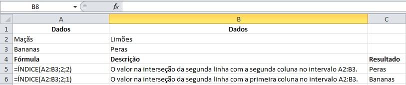

 

**2.2 Referencial**

A função índice referencial retorna a referência da célula na interseção de linha e coluna específicas. Se a referência for composta de seleções não adjacentes, você poderá escolher a seleção que deseja examinar. 

Esta versão da função índice permite que você selecione mais de uma área (ou seja, pode ser usada também com mais de uma tabela).

A fórmula é composta por dois argumentos obrigatórios:  
- uma referência a um ou mais intervalos de célula;  
- o número da linha de onde será fornecidade uma referência;

O número da coluna e da área são opcionais.

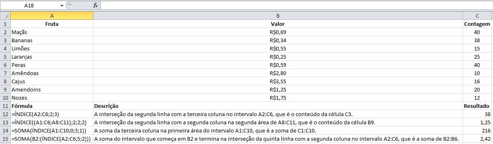

 

#### **3. Função Corresp**
A função Corresp procura um item especificado em um intervalo de células e retorna a posição relativa desse item no intervalo. Por exemplo, se o intervalo ``A1:A3`` contiver os valores 5, 25 e 38, a fórmula ``=CORRESP(25,A1:A3,0)`` retornará o número 2, porque 25 é o segundo item no intervalo.

Dica: use Corresp no lugar de uma das funções PROC quando você precisar da posição de um item em um intervalo em vez do item propriamente dito. Por exemplo, você pode usar a função Corresp para fornecer um valor para o argumento núm_lin da função Índice.

A sintaxe é composta por dois argumentos obrigatórios e um argumento opcional:  
- o primeiro argumento é o valor procurado por você, que pode ser um número, texto ou valor lógico.  
- o segundo item é a matriz procurada, ou seja, o intervalo de células a serem pesquisadas.  
- o terceiro item (opcional) é o tipo de correspondência, que especifica como o excel faz a correspondência do valor procurado; o valor padrão para este argumento é 1.

Segue um exemplo:

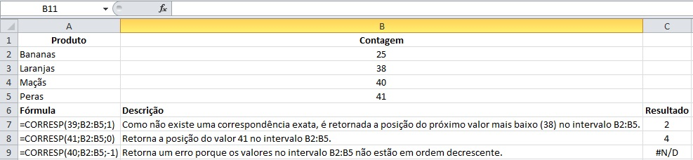

Tipo de correspondência | Comportamento
----------------------- | -------------
1 ou não especificado | CORRESP localiza o maior valor que é menor do que ou igual a valor procurado. Os valores no argumento matriz procurada devem ser colocados em ordem crescente; por exemplo: . . . -2, -1, 0, 1, 2, . . ., A-Z, FALSO, VERDADEIRO.
0 | CORRESP localiza o primeiro valor que é exatamente igual a valor procurado. Os valores no argumento matriz procurada podem estar em qualquer ordem.
-1 | CORRESP localiza o menor valor que é maior ou igual ao valor procurado. Os valores no argumento matriz_procurada devem ser colocados em ordem decrescente como, por exemplo: VERDADEIRO, FALSO, Z-A . . . 2, 1, 0, -1, -2 . . . e assim por diante.

 

#### **4. Combinando as funções Índice e Corresp**

Como vimos anteriormente, os argumentos da função índice representam a posição de um dado em células organizadas em uma mesma linha, ou em uma mesma coluna, ou seja, justamente o que a função Corresp faz. Assim podemos incluir o Corresp nestes argumentos da função índice.

A tabela abaixo contém alguns dados sobre a população dos países membros dos BRICS e queremos descobrir qual dos países tem o percentual de população feminina igual a 48,29%.

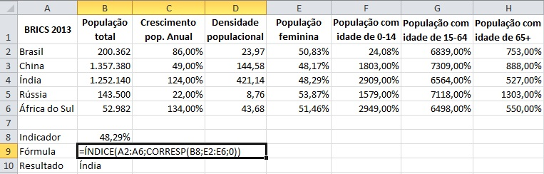

Elementos da fórmula:  
- matriz → A2:A6 = área onde estão os dados com os nomes dos países.  
- núm_linha → função CORRESP  
- valor_procurado → B8 = célula onde está o valor do indicador que queremos a informação.  
- matriz_procurada → E2:E6 = intervalo onde estão os dados do indicador desejado.  
- [tipo_correspondência] → 0 (zero), pois é o valor que indica a função que queremos uma correspondência exata.  
- [núm_coluna] → não aparece na função. Se trata de um dado opcional e desnecessário neste caso, já que a área que selecionamos em matriz possui somente uma coluna. Deixar esse argumento em branco ou com o valor 1, dá na mesma.

Então, resumindo, o que dissemos para esta fórmula fazer foi:  
No intervalo B6:B10, retorne o dado que estiver na mesma posição que o valor 48,29% está no intervalo de F6:F10. Ou seja, retorne o dado que estiver na 3ª posição no intervalo de B6:B10.

O resultado dessa fórmula é Índia, pois é o país com 48,29% de população feminina.

Fonte da questão <a href="https://www.funcaoexcel.com.br/indice-corresp-um-procv-melhorado/" target="_blank">aqui</a>.

 

#### **5. Função Somase**
A função somase é utilizada para somar os valores em um intervalo que atendem aos critérios estabelecidos.
Por exemplo, imagine que em uma coluna você precisa somar apenas os valores maiores do que 100. Você pode fazer isso usando a seguinte fórmula:

 ``=SOMASE(C2:C11;">100")``

Note que o primeiro argumento da fórmula simplesmente define o intervalo escolhido e o segundo argumento define a condição estabelecida por você.

A seguir temos um exemplo de como usar essa função:

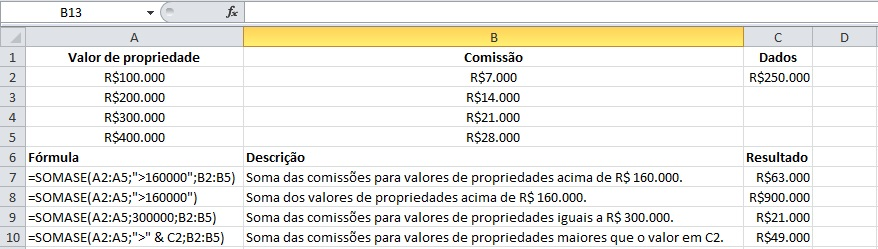

Outro exemplo: 

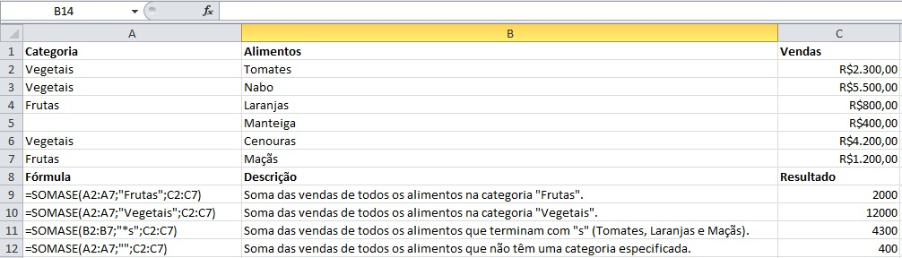

 

#### **6. Função Cont.se**
Esta função é usada para contar o número de células que atendem a um determinado critério. A função é composta por dois argumentos:  
- o primeiro argumento é o intervalo onde você quer procurar algo.  
- o segundo argumento é o seu critério.  
Por exemplo, ``CONT.SE(A2:A5;"maçãs")``. Este e outros exemplos podem ser observados a seguir:

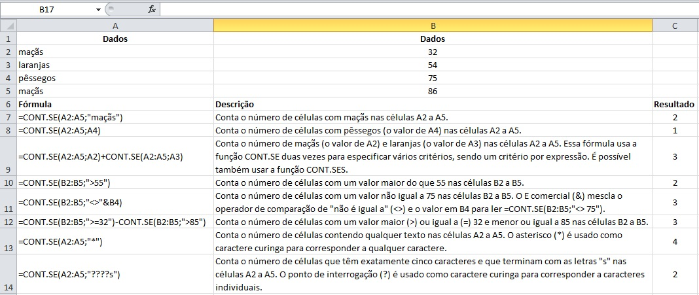

 

#### **7. Função Cont.ses**
A função cont.ses aplica critérios a células em vários intervalos e conta o número de vezes que todos os critérios são atendidos.

A sintaxe da função tem dois argumentos obrigatórios:  
- o primeiro argumento é o intervalo no qual iremos avaliar os critérios estabelecidos.  
- o segundo argumento trata dos critérios que devem ser avaliados.
 
Além disso, podem ser adicionados outros critérios, sendo permitidos até 127 critérios ou intervalos.

Segue um exemplo:

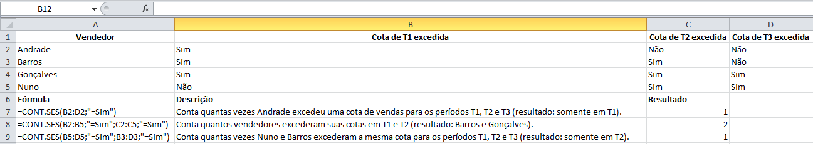

Outro exemplo:

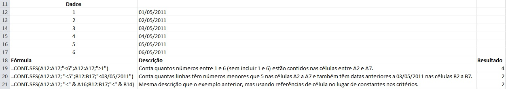

Observação: se você pretende fazer a contagem usando um único critério, use a função ``cont.se``, já abordada anteriormente.

 

#### **8. Gráficos**
Criar gráficos no Excel é muito simples. Você precisa selecionar o seu conjunto de dados e escolher o tipo de gráfico que você quer fazer. Segue o passo a passo:

Passo 1: selecione o conjunto de dados.  
Passo 2: vá na aba Inserir. 
Passo 3: escolha o tipo de gráfico que você quer (lembrando que cada tipo de gráfico faz sentido para uma função diferente).

Exemplo de um gráfico simples de dispersão:

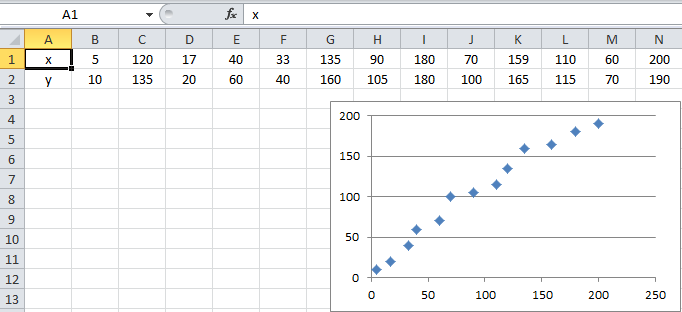

 

#### **9. Tabela Dinâmica**

Uma Tabela Dinâmica é uma ferramenta poderosa para calcular, resumir e analisar os dados que lhe permitem ver comparações, padrões e tendências nos dados.

Passo 1 : o primeiro para criar uma Tabela Dinâmica é selecionar os dados a partir dos quais você quer criar a tabela. Os dados selecionados não podem ter colunas ou linhas vazias e deve haver uma linha única para os títulos.  
Passo 2: depois de selecionados os dados, clique em ``inserir`` -> ``tabela dinâmica``.  
Passo 3: em ``Tabela/Intervalo``, verifique o intervalo de células.  
Passo 4: em ``Escolha onde deseja que o relatório da Tabela Dinâmica seja posicionado``, selecione ``Nova Planilha`` para posicionar a Tabela Dinâmica em uma nova planilha, ou escolha ``Planilha Existente`` e selecione o local em que deseja exibir a Tabela Dinâmica.  
Passo 5: selecione ``ok``.  
Passo 6: depois disso, no lado direito de sua tela, selecione os dados que você quer inserir na tabela e observe como ela foi criada automaticamente. Se necessário, mude os itens nos campos disponíveis no canto inferior direito de forma que a tabela faça mais sentido/seja mais fácil de interpretar.

A seguir está um exemplo (à esquerda estão os dados sem nenhuma formatação ou edição e à direita está a tabela dinâmica):

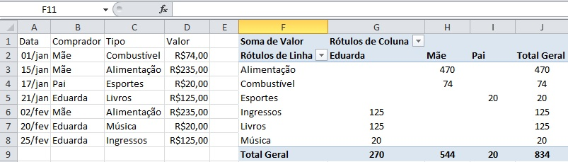

 

#### **10. Gráfico Dinâmico**
Os Gráficos Dinâmicos são uma ótima maneira de adicionar visualizações aos dados, já que os dados em formato de gráfico geralmente são muito mais intuitivos do que os mesmos em tabelas.  
Para adicionar um gráfico dinâmico, os passos são basicamente os mesmos da tabela dinâmica:  
Passo 1: selecione os dados, depois clique em ``inserir`` > ``gráfico dinâmico``.  
Passo 2: em ``Tabela/Intervalo``, verifique o intervalo de células.  
Passo 3: em ``Escolha o local no qual deseja que a tabela e o gráfico dinâmicos sejam colocados``, selecione ``Nova Planilha`` para posicioná-los em uma nova planilha, ou escolha ``Planilha Existente`` e selecione o local em que deseja exibi-los.  
Passo 4: selecione ``ok``.  

Depois disso, no lado direito de sua tela, selecione os dados que você quer inserir no gráfico e mude os itens nos campos disponíveis no canto inferior direito de forma que seu gráfico faça mais sentido/seja mais fácil de interpretar.

A seguir está um exemplo de gráfico dinâmico juntamente com a tabela que deu origem ao mesmo.

 

#### **11. Dashboard**
Um dashboard é uma representação visual de métricas de chave que lhe permitem rapidamente ver e analisar os seus dados num único local. Dashboards apenas não fornecem vistas de dados consolidados, mas os utilizadores irão conseguir filtrar os dados para apresentar apenas o que é importante.

Para criar um dashboard dinâmico siga os seguintes passos:

Passo 1: crie duas abas no Excel.  
Passo 2: transforme as tabelas comuns em tabelas dinâmicas.  
Passo 3: crie um gráfico dinâmico.  
Passo 4: personalize o seu dashboard formatando-o.

 

#### **12. Guia Desenvolvedor**
A guia Desenvolvedor não é habilitada por padrão. É interessante habilitá-la, pois ela permite que tenhamos acesso a comandos mais avançados como Macros, botões e acesso ao VBE (Visual Basic Editor).

No guia ``arquivo``, clique em ``opções`` e ``personalizar faixa de opções``. Depois em ``guias principais`` marque a caixa de seleção ``desenvolvedor``.

Depois que você optar por mostrar a guia, ela permanecerá visível, a menos que você desmarque a caixa de seleção ou precise reinstalar um programa do Microsoft Office.

 

#### **13. Macros**

Macro é um conjunto de ações e comandos que são gravados ou programados com o objetivos de serem executados em um único comando. É uma forma de automatizar ações. As macros são armazenadas em uma linguagem chamada VBA (Visual Basic for Applications).

Gravando uma macro:
Passo 1: na guia ``desenvolvedor`` clique em ``gravar macro``.
Passo 2: dê um nome para a sua macro, de preferência sem espaços, acentos e cedilha.
Passo 3: indique uma tecla de atalho. Utilize teclas de atalho que ainda não existam. Por exemplo: ``Ctrl``+ ``Shift`` + ``C``.
Passo 4: armazene a macro nesta pasta de trabalho.
Passo 5 (opcional): informe a descrição, o que essa macro é capaz de fazer. Será o comentário no VB.
Passo 6: aperte ``ok``.

A partir desse momento, suas ações serão convertidas em códigos, para serem executadas quando você solicitar.

Selecione uma célula e digite o texto: Oi, mundo! Aperte a tecla ``enter``.

Passo 7: clique em ``parar gravação``.
Agora teste o resultado: apague o conteúdo da célula e digite ``Ctrl``+ ``Shift`` + ``c``.

 

**13.1 Referências absolutas**:

Gravar em referências absolutas significa dizer que será representado no Visual Basic a referência exata da sua execução. Ou seja, se você está gravando a macro, selecionou a célula A6 e pediu para preencher o fundo da célula de vermelho, quando solicitar para executar a macro, ela será executada exatamente na célula A6.

 

**13.2 Referências relativas**:

Macros com referências relativas são gravadas começando na célula que está selecionada. Por exemplo: se marcamos a opção “utilizar referências relativas” para gravar uma macro, a célula selecionada será a referência inicial. Isto é, a sua função não será executada apenas na célula onde você a gravou, mas sim em qualquer célula que você selecionar.

Para usar esta função, você deve ativar a opção ``usar referências relativas`` logo abaixo da opção ``gravar macro``.

Uma macro pode ser editada no Editor do Visual Basic.

É importante tomar cuidado com a execução de uma macro, pois após a execução, não é possível voltar, ou seja, não é possível dar ``ctrl`` + ``z``.

 

**a) Botões para Macros** 

Uma macro pode ser executada também a partir de uma figura, de um texto em WordArt ou um botão. Para adicionar uma macro em um botão siga as instruções: 

Passo 1: Na guia ``Desenvolvedor``, selecione ``Inserir`` e`clique na primeira opção (``botão``). 
Passo 2: Desenhe o botão em alguma área de sua planilha. 
Passo 3: Atribua uma macro ao botão. 
Passo 4: Aperte Ok. Pronto! A partir de agora, toda vez que você clicar no botão a macro será executada. 
Para editar o nome no botão, clique com o botão direito e selecione Editar Texto. 

 

**b) Habilitar Macros** 

Na guia ``Arquivo``, ``Opções``, é possível habilitar as macros com restrições ou não. Acesse a opção ``Central de Confiabilidade``. Clique em ``Configurações de Central de Confiabilidade`` e ``Configurações de Macro``..

A Microsoft não recomenda habilitar todas as macros. Neste sentido, sugerimos que marque a opção ``Desabilitar todas as macros com notificação``.

 

**c) Salvar pasta de trabalho**

Para salvar uma pasta de trabalho com a possibilidade de executar as macros do arquivo, é necessário salvar como pasta habilitada para macros. Assim, ela ficará com a extensão de arquivo .xlsm 

Passo 1: Na guia ``Arquivo``, selecione a opção ``Salvar como``. 
Passo 2: Marque o tipo, Pasta de Trabalho Habilitada para Macro do Excel. 
Passo 3: Aperte ok.

Agora todas as macros que foram gravadas ou programadas no VB estarão disponíveis para posterior utilização. 

 

**d) Criando uma Macro no VBE**

Passo 1: Abra o Visual Basic (Alt+F11) ou pela guia Desenvolvedor. 
Passo 2: No menu Inserir, do VB, insira um novo Módulo. 
Passo 3: Copie do arquivo Macros.txt. 
Passo 4: Cole no Módulo que você inseriu. 
Passo 5: Feche o VB. 

 

### **Atalhos**

 

**1. Selecionar linhas e colunas:**

Primeira opção: clicar no número da linha ou no nome da coluna.
Segunda opção: parar na coluna de interesse e usar ctrl e espaço (seleciona a coluna inteira); ou parar na linda de interesse e pressionar ``shift`` + ``espaço`` (seleciona a linha inteira).

 

**2. Inserir linhas:**

Primeira opção: clicar no número da linha e clicar em Inserir ou clicar no número da linha e digitar ``i``.

Segunda opção: selecionar a linha abaixo da qual você pretende inserir uma nova linha (lembre-se da primeira dica: selecione a linha utilizando o atalho ``shift`` + ``espaço``). Depois que a linha estiver selecionada, pressione ``ctrl`` + ``+`` (caso não tenha o + separado no seu teclado, pressione ``ctrl`` + ``shift`` + ``+``).

Dica adicional: caso você queira incluir mais de uma linha, basta selecionar o número de linhas que você quer incluir segurando a tecla shift e indo com a seta para baixo ou para cima e depois usar o atalho para inserir as linhas (``ctrl`` + ``+``). O mesmo vale para as colunas.

 

**3. Apagar linhas:**

Para apagar a linha, o atalho segue a mesma ideia da dica anterior: selecione a linha e pressione ``ctrl`` + ``-``.

 

**4. Andando pelas células da planilha:**

Se você tem uma planilha com muitos dados e quer andar entre as células, há alguns atalhos úteis para isso:

Para ir para a última linha: ``ctrl`` + ``seta para baixo``;  
Para ir para a primeiro linha: ``ctrl`` + ``seta para cima``;  
Para ir para a primeira coluna: ``ctrl`` + ``seta para a esquerda``;  
Para ir para a última coluna: ``ctrl`` + ``seta para a direita``;  
Para ir para a primeira célula da planilha (A1): ``ctrl`` + ``home``.

 

**5. Selecionando linhas e colunas:**

Usando os mesmos atalhos da dica 4 juntamente com a tecla ``shift``, é possível selecionar várias linhas e várias colunas.

Ex.: para selecionar uma linha inteira (a partir da célula em que você está), pressione ``ctrl`` + ``shift`` + ``seta para cima`` ou ``seta para baixo``. O mesmo vale para selecionar várias colunas. Use os mesmos atalhos combinados com as setas para os lados.

Se a intenção é selecionar toda a sua planilha, pressione ``ctrl`` + ``*``. No caso de laptops, o ``*`` costuma ficar acima do número 8. Então o atalho é: ``ctrl`` + ``shift`` + ``8``.

 

**6. Aumentando a altura das linhas:**

Selecione todas as linhas. Lembra do nosso atalho para isso? Nesse caso, basta selecionar a primeira linha com o atalho ``shift`` + ``espaço`` e depois selecionar até a última linha com o atalho ``ctrl`` + ``shift`` + ``seta para baixo``.

Caso ache mais fácil, selecione tudo com o mouse ou marque a primeira linha e pressione ``shift`` + ``seta para baixo`` até chegar na linha desejada.
Depois, vá com o cursor até a linha entre os números das linhas. O cursor vai virar uma pequena cruz. Selecione e puxe para baixo deixando a linha do tamanho desejado. Com isso, todas as linhas ficarão com a mesma altura.

 

**7. Preenchendo as células automaticamente:**

Se você precisa enumerar algumas células do número 1 ao 100, por exemplo, você já sabe que pode inserir o número 1 em uma célula, o número 2 na célula seguinte, selecionar as duas, clicar com o mouse no canto inferior direito da célula de baixo e puxar para baixo, certo? Com isso, as próximas células serão preenchidas automaticamente até o número que você deseja.

Porém, se você colocar o indicador ordinal, assim: 1º, 2º, 3º etc. esse atalho não funciona mais, pois o tipo da célula muda.
Qual a solução então? Terei que digitar tudo até o 100 ou até o 500, 700, dependendo do caso? Não. Tem uma forma muito mais simples. Vamos lá!

Primeiro faça normalmente o primeiro passo (digitar os dois primeiros números, selecionar e puxar até o número desejado). Com isso, todos os números estarão selecionados. Se não estiverem, selecione-os. Então pressione ``ctrl`` + ``1`` e a aba de formatação de células será aberta (outro atalho bacana, olha só!). Clique em ``personalizado``, depois escolha o número ``0`` (ele provavelmente estará como ``geral``). Agora edite o ``tipo`` adicionando ``"º"`` (o símbolo de grau entre aspas) na frente do número e clique em ``ok``. Pronto! Parece complicado, mas é muito simples. É só seguir esses passos e a sua lista de números ordinais está pronta!

Ah, e caso você queira adicionar mais números, agora é só selecionar e puxar para baixo que vai funcionar normalmente.

 

**8. Tabela zebrada:**

Primeiro selecione a sua tabela (``ctrl`` + ``*``), depois clique em ``formatação condicional`` e em ``nova regra``. Escolha a última opção da lista (``Usar uma fórmula para determinar quais células devem ser formatadas``). 

Agora clique na caixa de texto logo abaixo e digite: ``=MOD(LIN();2)=0``.

O próximo passo é clicar em ``formatar`` ainda nesta janela. Com isso, uma nova janela será aberta. Selecione a opção ``preenchimento`` e escolha a cor desejada. Prontinho! Sua planilha agora tem uma linha de cada cor. Inclusive, você pode adicionar mais linhas que o padrão será mantido.

 

### **Erros comuns**
 

**1. #VALOR!**

Esse é um dos erros mais comuns e acontece devido a um erro de sintaxe ou de referência às células. Por exemplo, esse erro irá ocorrer se você tentar somar dois valores escrevendo “=A1-B1” em uma célula. Para resolvê-lo, basta utilizar corretamente a função SOMA.
 
 
**2. #REF!**

Esse erro acontece quando um valor referenciado anteriormente para a utilização em uma fórmula ou função acaba sendo excluído ou suprimido de alguma maneira. Para resolver o problema, procure o local de referência e veja quais dados estão faltando. 
 
 
**3. #NUM!**

O erro #NUM! acontece quando uma célula contém valores inválidos. Números grandes demais para serem calculados pelo Excel ou impossibilidades matemáticas como raízes de números negativos são exemplos do que pode dar errado nesses momentos.
 
 
**4. #NOME?**

O erro #NOME? acontece quando há algo digitado de forma errada, como escrever “=SOM” ao invés de “=SOMA”, por exemplo. Uma confusão comum entre os usuários do Excel é acabar utilizando o nome das fórmulas em outros idiomas como o inglês. Escrever “=SUM” em um programa configurado em inglês funcionará perfeitamente, mas não em um configurado para funcionar em português.
 
 
**5. #N/D**

Esse erro acontece nas funções Procv, Proch, Proc e Corresp quando elas não conseguem achar determinados valores. Verifique a fonte dos dados e veja se o item relacionado possui um valor válido.
 
 
**6. #DIV/0!**

O erro #DIV/0! acontece quando tentamos dividir um valor por zero ou uma célula é dividida por outra vazia. Para resolver, é só alterar o valor para algo diferente de zero, alterar a referência para uma célula que não esteja vazia ou inserir o indicador #N/D para indicar a indisponibilidade do cálculo. 
 
 
**7. #####**

Esse erro também é muito comum e ocorre quando a coluna não é larga o suficiente para exibir o valor por inteiro. Para resolver, basta aumentar o tamanho até o número aparecer. 

A fonte consultada pode ser vista <a href="https://www.sos.com.br/noticias/excel/os-principais-erros-no-excel-saiba-como-resolve-los" target="_blank">aqui</a>.