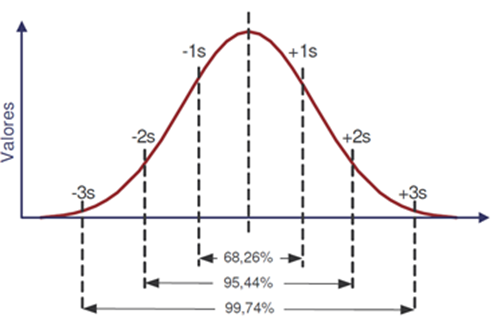

Nesta seção serão disponibilizados os principais conceitos do mercado finaneiro, especialmente aqueles necessários para a certificação CPA-20. Para organizar o conteúdo, serão tomados como base os módulos da prova.
 
 
A sigla CPA significa Certificação Profissional Anbima e ela é uma certificação básica para quem quer entrar no mercado financeiro e trabalhar com a distribuição de produtos de investimentos. Como foi dito, os conteúdos aqui estarão disponíveis na ordem dos módulos cobrados na prova e podem ser um bom resumo para os estudos (foi o resumo que eu fiz e utilizeu para estudar para a prova).
 
 
Caso você tenha interesse em trabalhar nesta área, saiba que há muito material gratuito disponível na internet. O professor Fábio Louzada disponibiliza diversas lives e questões sobre o assunto. O site e o aplicativo da TopInvest também têm muito conteúdo bacana. Além disso, você pode ir no youtube e pesquisar por "cpa-20 edgar abreu" que você vai encontrar diversas vídeo-aulas sobre cada um dos módulos cobrados na prova.
 
 
Caso tenha interesse em fazer a prova, mais informações podem ser encontradas no site oficial da <a href="http://www.anbima.com.br/pt_br/index.htm" target="_blank">Anbima.</a> 

 

#### **Módulo 1 - Sistema Financeiro Nacional**
 

**Conselho Monetário Nacional (CMN)**

* autoridade máxima do sistema financeiro nacional.
* membros:
    1. ministro da Fazenda
    2. ministro do Planejamento
    3. Presidente do BACEN
* funções: cria normas, regula, define meta de inflação.
 
 

**Banco Central**

* composto por 8 diretorias + presidente (mesmo presidente do COPOM)
* órgão executor
	* emite papel moeda, fiscaliza, pune, executa etc.
	* recebe depósitos compulsórios, fiscaliza instituições financeiras.
	* realiza operações de redesconto, gerencia reservas internacionais etc.
 
 

**Comissão de Valores Mobiliários (CVM)**

* composta por 1 presidente + 4 diretores.
* fiscaliza, pune, investiga e coíbe fraudes; protege o investidor.
	* mercado de ações, fundos imobiliários (FIs), debêntures, CRIs, CRAs etc.
 
 

**Superintendência de Seguros Privados (SUSEP)**

* composto por 1 superintendente + 4 diretores.
* controla e fiscaliza o mercado de seguros, resseguros, capitalização e previdência complementar **aberta**.
 
 

**Superintendência Nacional de Previdência Complementar (PREVIC)**

* exerce as mesmas funções da SUSEP, porém para a previdência complementar **fechada**.
	* fundos de pensão.
 
 

**Tesouro Nacional**

* cuida dos recursos da União e emite títulos públicos.
 
 

* Dealers

	* instituições financeiras credenciadas pelo Tesouro para participarem ativamente da compra e venda de títulos.
	* atualmente são 12 dealers (10 bancos e duas corretoras).
	* desempenho avaliado a cada 6 meses.
 
 

**Associação Brasileira das Entidades dos Mercados Financeiros e de Capitais (ANBIMA)**

* responsável pela autorregulação do mercado de capitais.
 
 

**Tipos de bancos**  

1. **comercial**:

	* depósito à vista, depósito a prazo com rendimento (CDB).
	* possibilidade de empréstimos e rendimentos.
	* instituições financeiras privadas ou públicas S/A.

2. **investimento**: 

	* foco em investimentos de médio e longo prazo.
	* é permitida a abertura de conta corrente, mas não pode emitir cheque.

3. **múltiplos**:

	* opera com múltiplas carteiras.
	* uma delas deve ser comercial ou de investimentos.

4. **outras modalidades**:

	I. sociedade de crédito imobiliário.  
	II. sociedade de credito financiamento e investimento.  
	III. banco de desenvolvimento.  
	IV. arrendamento mercantil.  
 

**Bolsa de valores (B3)**

* ambiente eletrônico para negociação de títulos e valores mobiliários.
 
 

**Sociedades distribuidoras /corretoras de títulos e valores mobiliários (DTVM/CTVM)**

* instituição financeira sob a forma de sociedade por ações ou por quotas de responsabilidade limitada.
* podem administrar fundos e clubes de investimentos, intermediar operações de câmbio, distribuir produtos de outras instituições financeiras etc. 
* obs.: corretagem de até 0,5% sobre o valor negociado.
 
 

**Clearing – sistemas e câmara de liquidação e custódia**

* trazem segurança ao sistema financeiro.
	1. Sistema Especial de Liquidação e Custódia (SELIC).
		* títulos públicos federais (D+0).
	2. Central de liquidação e custódia de títulos (CETIP).
		* títulos privados: CDB, debêntures, LCI, LCA etc. (D+0 e D+1).
	3. Câmara de ações (CA) – antiga CBLC
		* ações, derivativos (futuro, opções, termo) (D+3 – que em 2019 passou a ser D+2).
 
 

**Sistema de pagamentos brasileiro (SPB)**

* finalidade: transferir recursos entre bancos viabilizando o processamento e a liquidação de pagamentos de pessoas, empresas, governo, BC e instituições financeiras.
 
 

**Tipos de investidor**

1. comum

2. **qualificado** 
    * valor mínimo: 1 milhão.

3. **profissional**

    * valor mínimo: 10 milhões.
    * tem acesso a produtos diferenciados.
    * instituições financeiras, seguradoras, entidades de previdência etc.

4. **não-residente**

    * residência no exterior e investimento no Brasil.
    * é considerado investidor profissional.

 

#### **Módulo 2 – Compliance, Ética e Análise do perfil do investidor**
 

**Prevenção contra a lavagem de dinheiro**

* 3 etapas (COIn):
	1. **colocação**: inserção do dinheiro na economia (depósitos, compras de bens, financiamento dos valores etc.).
	2. **ocultação**: dificultar o rastreamento dos recursos (movimentar o dinheiro anonimamente, transferir para contas anônimas etc.).
	3. **integração**: os recursos são incorporados  ao sistema financeiro (investir em empreendimentos).
 
 

**Conselho de Controle de Atividades Financeiras (COAF)**

* órgão máximo de combate à lavagem de dinheiro, vinculado ao ministério da Fazenda.
 
 

**Ações preventivas**

* conheça o seu cliente (know your customer)
	* cadastro atualizado (doc., profissão, escolaridade, patrimônio, renda mensal etc.).
	* observação da movimentação financeira.
* identificação e registro de operações
	* manter registros pelo prazo de 5 anos (podendo ser estendido).
* comunicação ao COAF:
	* valor maior ou igual a 50 mil.
	* movimentação suspeita de valor maior ou igual a 10 mil.
	* a comunicação deve ser feita até o próximo dia útil (o cliente não deve ser avisado).
* diretor responsável pelo cumprimento das medidas.
 
 

**Penalidades administrativas**

1. advertência.
2. multa pecuniária variável não superior a:
	a) ao dobro do valor da operação.
	b) ao dobro do lucro real obtido pela operação.
	c) ao valor de R$ 20 milhões (o que for menor).
3. inabilitação por até 10 anos para cargos administrativos.
4. cassação ou suspensão da autorização para exercício da atividade.
 
 

**Responsabilidade e corresponsabilidades**

* não há crime sem criminoso.
* reclusão de 3 a 10 anos e multa.
* a pena pode ser reduzida de 1 a 2/3 ou regime prisional convertido (de fechado para aberto).
 
 

**Outros conceitos**

* **risco legal**: relacionado à não execução de um contrato.
* **risco de imagem**: relacionado à reputação da instituição.
* **venda casada**: condicionar a venda de um produto à aquisição de outro (é diferentes de vantagens oferecidas a clientes).
* **insider trading**: uso de informações que ainda não se tornaram públicas (ex.: comprar ações porque sabe de uma futura fusão).
* **front running**: uso de informações sobre operações no mercado que influenciarão nos preços (ex.: comprar ações antes do cliente).
* Controles internos: segregação de funções (**chinese wall**).
* Restrições do investidor: capacidade x vontade de correr risco (idade, horizonte de investimentos, conhecimento do produto, tolerância ao risco etc.).
* Finanças pessoais:
	* balanço patrimonial pessoal: ativos e passivos.
	* fluxo de caixa: receitas e despesas.
	* orçamento doméstico: parecido com o segundo, mas com foco no futuro.
 
 

**Análise do perfil do investidor (API)**

1. **informações básicas**:
	* período que pretende manter o investimento.
	* preferência quanto os riscos.
	* finalidades do investimento.
2. **situação financeira**:
	* receitas regulares declaradas.
	* valor e ativos do patrimônio.
	* necessidade futura de recursos.
3. **conhecimento sobre o produto**:
	* produtos, serviços e operações que tem familiaridade.
	* informações sobre operações já realizadas no mercado (natureza, volume frequência, período etc.).
	* formação acadêmica e experiência profissional.
4. **análise dos produtos**:
	* riscos.
	* perfil dos emissores.
	* existência ou não de garantias.
	* prazos de carência.
5. **é vedada a recomendação de produtos**:
	* perfil não adequado.
	* informações do cliente não obtidas.
	* informações não atualizadas (2 anos).
		* aplicação por ordem do investidor pode ser feita, mas o profissional deve obter declaração do cliente e alertá-lo.
6. **a verificação do perfil é dispensável quando**:
	* for investidor qualificado ou profissional.
	* PJ de direito público.
	* cliente com carteira administrada discricionariamente por adm. autorizado.
 
 

**Finanças comportamentais**

* As quatro principais heurísticas:

	1. **representatividade**:
		* amostra pequena, uso de estereótipos para julgamento (ex.: olhar o desempenho passado sem considerar outros fatores).
	2. **disponibilidade**:
		* informações recentes, ignorando fatos, facilidade da informação na mente (ex.: olhar apenas para o lucro).
	3. **ancoragem**:
		* fazer estimativa a partir de um valor inicial (ex.: marketing de desconto).
	4. **aversão à perda**:
		* relacionada ao medo de assumir o erro (ex.: não vender uma ação esperando ela valorizar).

 

#### **Módulo 3 – Noções de economia e finanças**
 

**Produto Interno Bruto (PIB)**

* soma de todos os bens e serviços finais, em termos monetários e a valor de mercado, produzidos em uma determinada região durante certo período.
* PIB = C + I + G + (X - M).
* método do valor agregado (bens e serviços finais).
 
 

**Índice de Preços ao Consumidor Amplo (IPCA)**

* calculado pelo IBGE e usado pelo CMN para definir a meta de inflação.
* famílias que ganham de 1 a 40 salários mínimos residentes nas regiões metropolitanas das principais capitais.
* o CMN estabelece a meta da inflação ao BACEN.
 
 

**Índice Geral de Preços do Mercado (IGP-M)**

* calculado pela FGV.
* criado para abranger o atacado e a construção civil.
* é composto pelos seguintes índices:
	1. IPA – índice de preços do atacado – 60%.
	2. IPC – índice de preços ao consumidor – 30%.
	3. INCC – índice nacional da construção civil – 10%.
* é usado para indexar contratos.
* período de casa índice IGP-M:
	* dia 21 ao dia 20: IGP-M.
	* dia 01 ao dia 20: IGP-DI.
	* dia 11 ao dia 10: IGP-10.
 
 

**Taxa de juros – SELIC**

* quanto maior esta taxa, menor será o consumo e o investimento em produção.
* **Selic meta**: definida pelo COPOM.
* **Selic over**: média das negociações de títulos públicos.
 
 

**Certificado de Depósito Interbancário (CDI)**

* média das negociações interbancárias.
* a taxa DI é o principal indexador no mercado de renda fixa.
 
 

**Taxa Referencial (TR)**

* usada para remunerar a poupança e o FGTS e na correção de contratos de crédito imobiliário.
* esta taxa deriva da TBF (taxa básica financeira) que, por sua vez, deriva das LTNs (letras do tesouro nacional).
* a fórmula da TR  é TR =  100 * [(1 + TBF) / R – 1] e ela é calculada pelo BACEN.
* obs.: já faz um bom tempo que esta taxa está zerada.
 
 

**Taxa de câmbio**

* quantidade de reais necessária para comprar um dólar
* taxa **SPOT**: taxa para compra e venda imediata de dólares.
* taxa **PTAX**: média das cotações de dólar no mercado, calculada pelo BACEN e usada para liquidação de contratos no mercado financeiro.
 
 

**Comitê de Política Monetária (COPOM)**

* composto pela diretoria colegiada do BACEN.
* define a taxa SELIC e o viés (tendência de alta ou baixa da taxa).
* 8 reuniões ao ano.
 
 

**Instrumentos de política monetária**

* política de controle da liquidez e da inflação.
    1. **taxa SELIC**
	    * contracionista: + juros -> - investimento e consumo -> - inflação.
	    * expansionista: - juros -> - investimento e consumo -> + PIB e emprego (pode provocar aumento da inflação).
    2. **taxa de redesconto** (taxa de juros do BACEN para empréstimos aos bancos):
    	* contracionista: + taxa de redesconto -> - disponibilidade de crédito -> - investimento e consumo -> - inflação.
    	* expansionista: - taxa de redesconto -> + disponibilidade de crédito -> + investimento e consumo -> + PIB.
    3. **depósitos compulsórios** (parte dos recursos captados pelos bancos que devem ser depositados no BACEN)
    	* contracionista: + compulsório -> - disponibilidade de crédito -> - investimento e consumo -> - inflação. 
    	* expansionista: - compulsório -> + disponibilidade de crédito -> + investimento e consumo -> + PIB.
    	* o aumento do compulsório pode levar a um aumento da taxa de juros, pois os bancos terão menos recursos para emprestar.
	4. **open market (títulos públicos)**
    	* contracionista: BACEN emite/vende títulos -> - moeda em circulação -> - inflação (e + juros).
    	* expansionista: BACEN resgata/compra títulos -> + moeda em circulação -> + PIB.
    	* obs.: ao emitir títulos, há dois principais motivos para o aumento da taxa de juros:
            1. o aumento da dívida leva à perda de confiança, o que exige maiores juros.
            2. com menos moeda, os bancos têm menos recursos para emprestar (o que os leva a cobrar mais caro por eles).
        * outros dois problemas da política monetária com títulos públicos:
	        1. efeito de expulsão: ao vender títulos, há um incentivo para maior investimento no Estado e menor investimento no mercado.
	        2. déficit comercial: emissão de títulos atrai capital estrangeiro, que movimenta a taxa de câmbio, valorizando a moeda nacional, facilitando importações e dificultado exportações. 
 
 

**Política fiscal**

* receitas: tributos + privatizações.
* despesas: salários + obras + manutenção de patrimônio público.
* **contracionista**: + tributos e/ou - gastos do governo -> - investimento e consumo -> - inflação.
* **expansionista**: - tributos e/ou + gastos do governo -> + investimento e consumo -> + PIB e emprego.
	* provoca aumento da inflação e da dívida pública.
 
 

**Política cambial**

* para **evitar a desvalorização** do real:
	* BACEN vende dólares.
	* a desvalorização ocorre quando há muita demanda por dólar.
* para **evitar a valorização** do real:
	* BACEN compra dólares.
	* ocorre quando há pouca demanda por dólar.
* **real valorizado**:
	* gera desemprego e queda da arrecadação.
	* importaríamos muito, deixando de consumir aqui.
* **real desvalorizado**:
	* gera inflação, pois o produtor vende seu produto a um preço mais alto lá fora e, por isso, também cobrará mais caro aqui.
	* gera necessidade de aumento de impostos, pois há dívidas cotadas em dólares.
 
 

**Reservas internacionais**

* ativos dos bancos centrais mantidos em diferentes reservas.
* país com reservas maiores tem melhores condições de enfrentar crises econômicas.
 
 

**Contas do setor público**

* receitas - despesas não financeiras = **superávit ou déficit primário**.
* pagamento de juros sobre a dívida (desp. financ.) = **superávit ou déficit nominal**.
* **balança comercial**: comércio de bens e serviços na forma de importação e exportação (exp - imp).
	* pagamento de juros e dividendos entra na balança de serviços.
* **transferências unilaterais**: doações, subsídios (aquilo que não tem contrapartida).
* **conta corrente**: balança comercial + transferências unilaterais.
* **conta de capitais**: saldo líquido entre compra de ativos estrangeiros por residentes no Brasil e venda de ativos brasileiros a estrangeiros.
* **balança de pagamentos**: conta corrente + conta de capitais.
**Taxa de juros real e nominal**
* taxa real = [((1 + taxa nominal) / (1 + IPCA)) – 1 ] * 100.
* taxa nominal > inflação = nº menor do que o resultado da subtração direta (resultado positivo).
* taxa nominal < inflação = nº maior do que o resultado da subtração direta (resultado negativo).
* deflação (inflação negativa): resultado maior do que a soma direta.
 
 

**Regimes de capitalização**

* **capitalização simples**:
    * não há capitalização dos juros (2% a.m. = 24% a.a.)
* **capitalização composta**:
    * juros sobre juros (VF = VP (1 + i)^n.
* **taxa equivalente**:
    * usada para capitalização composta: TE = [(1 + i) ^(n1/n2)] * 100.
	* n1 = período da taxa conhecida; n2 = período da taxa procurada.
 
 

**Outros conceitos**

* **taxa livre de risco**: SELIC.
* **custo de oportunidade**: o que você perde escolhendo alguma coisa.
* **TIR**: taxa interna de retorno - para definir se um negócio vale a pena.
* **PMT**: payment – parcela.
* **WACC**: weighted average capital cost – custo médio ponderado do capital; média ponderada dos juros/dividendos (capital de terceiros e capital próprio).
* **alavancagem**: capital de terceiros/capital próprio.
* **prazo médio ponderado**: mensura o prazo com base no valor de cada título.
* **cupom**: pagamento periódico de rendimentos sobre um investimento (cupom zero recebe tudo no final).
* **mercado primário x secundário**: 
	* **primário**: empresa lança títulos no mercado pela primeira vez.
	* **secundário**: ativos negociados entre os investidores (permite a liquidez dos ativos).
* **preço unitário (PU)**: valor do título hoje na data de negociação.

 

#### **Módulo 4 – Instrumentos de renda variável, renda fixa e derivativos**
 

#### **4.1 Renda variável**

* menor fração do capital social de uma empresa.
    1. **ações ordinárias (ON)**: direito a voto.
        * a empresa pode emitir até 100% de ON.
    2. **ações preferenciais (PN)**: preferência nos dividendos.
	    * pelo menos 10% a mais de dividendos do que a ON.
	    * no máximo 50% das ações podem ser dessa categoria.
* três anos consecutivos sem distribuir dividendos: a ação PN passa a dar direito ao voto.
* o controlador da companhia precisa manter 50% + 1 das ON.
 
 

**Underwriting (subscrição)**

* ofertante: a empresa ofertará ações (responsável pelas informações).
* banco coordenador: líder da distribuição.
* banco liquidante (ou mandatário): vai liquidar as vendas.
* escriturador: abre e mantem o livro de registros e envia informações ao acionista.
* central depositária: assume fiduciariamente a titularidade dos ativos no livro dos acionistas.
* custodiante: movimenta as ações dos clientes na central depositária.
* market maker (formador de mercado): mantém oferta de compra e venda durante a sessão de negociação para manter a liquidez.
* agente fiduciário: presente apenas na oferta pública de ativos de renda fixa (debêntures, CRI, CRA). Protege os investidores.
* agências de rating: classificam o risco do emissor de um título de renda fixa (AAA a D).
* opções de underwriting:
	1. melhores esforços: o que sobrar volta para a empresa (ou seja, risco da empresa).
	2. residual: banco tenta vender novamente (risco do banco e da empresa).
	3. garantia firme: banco compra 100% (risco do banco).
 
 

**Prospecto**

* de responsabilidade do banco coordenador.
* contém características da oferta pública.
	* deve destacar que a oferta ainda está sob análise da CVM.
	* depois da aprovação, deve ser elaborado o prospecto definitivo.
 
 

**Conteúdo da oferta**

* pode ser dada prioridade aos antigos acionistas.
* se houver muita demanda, pode ser ofertado um **lote suplementar**.
	* não pode passar de 15% da quantidade ofertada.
* coleta de intenção de investimentos.
	* pode haver recebimento de reservas para subscrição ou aquisição de valores mobiliários.
* material publicitário: dependerá da aprovação da CVM.
 
 

**Initial Public Offering (IPO)**

* oferta no mercado primário.
* reserva: intenção de compra.
	1. ordem a mercado: investidor não estabelece o preço a pagar.
	2. ordem limitada: investidor limita a compra a um valor.
 
 

**Direitos do acionista**

1. **ganho de capital**: quando o investidor vende ações por preço superior ao da compra.
2. **subscrição**: garante a possibilidade de o acionista manter a mesma participação no capital total.
3. **tag along**: acionista minoritário pode vender suas ações por no mínimo 80% do valor pago ao majoritário.
	* em caso de troca de controle da companhia.
 
 

**Eventos societários**

* **dividendos**: distribuição de parte dos lucros aos acionistas pagos exclusivamente em dinheiro.
	* o estatuto deve prever a %, senão o mínimo é 25% (isento de IR).
* **juros sobre o capital próprio**: quando a empresa retém parte do lucro para reinvestimento ela deverá pagar juros por isso (o acionista paga 15% de IR retido na fonte).
* **bonificações**: distribuição de novas ações aos atuais acionistas em função do aumento do capital.
* **inplit** (grupamento): redução da quantidade de ações aumentando o valor de cada ação. Objetivo: redução do risco.
* **split** (desdobramento): aumento da quantidade de ações reduzindo o valor de cada ação. Objetivo: aumento da liquidez.
 
 

**Despesas**

* **corretagem**: tarifa para a corretora por toda ordem de compra e venda.
* **custódia**: tarifa de manutenção da conta (pode haver isenção).
* **emolumentos**: cobrados pela bolsa por pregão em que tenha ocorrido negócio.
	* a taxa é de 0,035% do valor financeiro da operação.
* **IR**: alíquota única de 15%.
	* recolhimento pelo próprio investidor via DARF.
	* apurado no mês da negociação e deve ser recolhido até o último dia útil do mês subsequente.
	* lucro do investidor é o valor de suas vendas menos suas despesas.
	* a corretora recolhe 0,005% na fonte (“dedo duro”: antecipação de IR).
		* fica dispensado se o valor for menor ou igual a R$ 1,00.
	* pessoa física que vende em um mesmo mês menos do que R$ 20 mil está isenta de IR.
	* não há IOF no mercado de ações.
	* **day trade**: alíquota de 20% de IR (via DARF).
		* corretora recolhe 1% sobre o lucro (dedo duro).
		* não há isenção.
 
 

**Compensação de perdas**

* se houver prejuízo, pode ser compensado no IR posteriormente.
* ex.: prejuízo de R$ 5.000,00 em abril e lucro de R$ 8.000,00 em maio.
	* IR sobre R$ 3.000,00 apenas.
* pode ser feita a qualquer momento (se ficar para o próximo ano, vai para a declaração anual).
* apenas investimentos na mesma modalidade.
 
 

**Governança corporativa**

* Nível 1:
	* % mínima de ações em free float (livre circulação) de 25%.
	* conselho de administração com no mínimo 3 membros com mandato unificado de até 2 anos.
	* calendário público de eventos corporativos.
	* tag along: 80% para ON.
* Nível 2:
	* todas as exigências do nível 1.
	* conselho de administração com no mínimo 5 membros (sendo no mínimo 20% independentes) com mandato unificado de até 2 anos.
	* demonstrativos financeiros nos padrões internacionais.
	* tag along: 100% para ON e 80% para PN.
* Novo Mercado:
	* todas as exigências do nível 2.
	* 100% das ações ON.
	* IPO mínimo de 10 milhões.
	* reunião pública anual em até 5 dias úteis após divulgação dos resultados trimestrais.
	* conselho de administração com no mínimo 5 membros (2 ou 20% - o que for maior - independente).
 
 

**Tipos de riscos**

* mercado: quando o preço muda.
* liquidez: dificuldade para vender por preço justo.
* em renda variável não há risco de crédito (risco de não pagamento).
 
 

**Análises**

* **técnica**: análise gráfica.
	* observa os preços passados (indicada para o curto prazo).
* **fundamentalista**: fatores macroeconômicos e fundamentos da empresa.
	* ajuda a saber se um preço é justo ou não.
	* indicadores utilizados:
		* **LPA (lucro por ação)**: lucro anual via dividendos: lucro líquido/quantidade de ações.
		* **P/L (preço/lucro)**: quanto tempo demora para recuperar o investimento: valor da ação/dividendos.
		* **EBITDA** (earnings before interest, taxes, depreciation and amortization): lucro antes dos impostos, taxas, depreciação e amortização. Mede a capacidade de geração de caixa.
 
 

**Recibos de depósitos de ações**

* ADR – American depositary receipt: empresa com sede fora dos EUA, mas com títulos negociados em sua bolsa.
* BDR – Brazilian depositary receipt: empresa com sede fora do Brasil, mas com títulos negociados aqui.
 
 

**Assembleia geral (ordinária e extraordinária)**

* AGO: convocada anualmente para deliberar sobre demonstrações contábeis
* AGE: demais assembleias.
 
 

**Outros termos do mercado de ações**:

* **swing trade**: investimento de curto prazo.
* **buy and hold**: ações mantidas por longo período.
* **circuit breaker**: se acionado, interrompe o pregão.
	* B3: acionado se houver queda de 10% no índice Ibovespa (30 min. de paralização); se continuar a queda e chegar a 15%: 1 hora de paralização.
* **DARF**: documento de arrecadação da receita federal.
* **home broker**: canal de relacionamento entre investidores e corretoras.
* **lote padrão**: lote de títulos iguais e em quantidade prefixada.
* **roadshow**: apresentar empresa para investidores.
* **bookbuilding**: formação de preços dos ativos normalmente por meio de leilão.
 
 

#### **4.2 Renda fixa**

* título com vencimento e taxa de juros conhecida no momento da contratação.
 
 

**IOF: Imposto sobre Operações Financeiras**

* cobrado até o 29º dia; isento a partir do 30º.
* 4-3-3 (1º dia: 96%; 2º dia: 93%; 3º dia: 90%, . . .,  29º dia: 3%; 30º dia: 0).
 
 

**Tabela regressiva de IR**

prazo | percentual
----- | ----------
até 180 dias | 22,5%
181 a 360 dias | 20%
361 a 720 dias | 17,5%
mais de 720 dias | 15%

* o IR é calculado sobre o rendimento após incidência de IOF.
* há isenção para pessoa física em ativos relacionados a imóveis e agronegócio.
 
 

**FGC – Fundo Garantidor de Crédito**

* mantido pelos bancos.
* instituição privada sem fins lucrativos, cujo objetivo é proteger os investidores contra o risco de crédito.
* cobertura de até 250 mil reais por CPF, por instituição.
	* limitada a 1 milhão de reais por um período de 4 anos.
* conta corrente, CDB, LCI, LCA, poupança, letras de câmbio, letra imobiliária, hipotecária etc.
 
 

**Caderneta de poupança**

* rentabilidade mensal – aniversário no dia da aplicação (dias 29, 30 e 31 = 01).
* liquidez diária, mas perda de rendimento em caso de saque antes do aniversário.
* **rentabilidade**: (regra a partir de 04/05/2012):
	1. SELIC maior do que 8,5% -> 0,5 a.m. (ou 6,17% a.a.) + TR.
	2. SELIC menor ou igual a 8,5% -> 70% da SELIC + TR.
* PJ tem rentabilidade trimestral.
* não há IOF.
* isenção de IR para pessoa física.
* no mínimo 65% do saldo da poupança deve ir para o crédito imobiliário.
 
 

**CDB – Certificado de Depósito Bancário**

* maneira de o banco tomar empréstimo de seus clientes.
* pode ser pré ou pós fixado.
* garantido pelo FGC.
* pode ou não oferecer liquidez diária.
* tabela regressiva de IOF e IR com retenção na fonte.
* apresenta risco de crédito, de liquidez e de mercado.
* não pode ser indexado à variação cambial.
 
 

**LF – Letra Financeira**

* semelhante ao CDB.
* elevado risco de crédito, pois não possui FGC.
* prazo mínimo de vencimento: 24 meses (portanto, IR de 15%).
* pode ter vencimento mais longo e admite pagamento de cupons.
* valor mínimo para emissão: 150 mil.
 
 

**DPGE – Depósito a Prazo com Garantia Especial**

* cobertura do FGC de até 20 milhões (por CPF, por instituição).
* mais utilizado por bancos menores.
* pode ser pré ou pós fixado.
* prazo de vencimento: de 6 a 36 meses.
* IR conforme tabela regressiva e tributação na fonte.
 
 

**LCI – Letra de Crédito Imobiliário**

* possui lastro, isto é, garantia real; também possui garantia do FGC.
* pessoa física é isenta de IR.
* prazos:
    * prazo mínimo de 12 meses, se atualizada anualmente por IPCA ou IGP-M.
    * prazo mínimo de 36 meses, se atualizada mensalmente por IPCA ou IGP-M.
    * prazo mínimo de 90 dias, se não for atualizada pelos índices de inflação.
 
 

**LCA – Letra de Crédito do Agronegócio**

* semelhante ao LCI, mas direcionado ao agronegócio.
* a garantia pode ser uma propriedade rural ou mesmo o penhor da safra.
* não pode ser emitida com atualização mensal por índice de preços.
 
 

**CCI – Cédula de Crédito Imobiliário**

* o banco antecipa os recebíveis.
* IR conforme tabela regressiva.
* não possui FGC, mas possui garantia real.
* qualquer investidor pode ter acesso, mas costuma ser negociado entre o emissor e companhias securitizadoras e fundos de investimento.
 
 

**CRI – Certificado de Recebível Imobiliário**

* título de longo prazo emitido por companhia securitizadoras.
	* transforma fluxos futuros em valores mobiliários.
* não possui FGC, mas possui lastro no crédito imobiliário (garantia real).
* emissão mínima: 300 mil reais.
* isenção de IR para pessoa física.
 
 

**CRA – Certificado de Recebível do Agronegócio**

* lastro no agronegócio e mesmas características do CRI.
 
 

**CPR – Cédula do Produtor Rural**

* emitido por produtor rural ou cooperativa para financiar a produção.
* produtor antecipa a venda de sua produção.
* banco ou seguradora dão aval/garantia.
* deve ser registrada em cartório.
* lastro geralmente é o penhor rural; não tem FGC.
* pode ser negociado no mercado primário ou secundário.
* pessoa física isenta de IR.
 
 

**CDCA – Certificado de Direitos Creditórios do Agronegócio**

* emitido por cooperativas ou PJs da área.
* negociação de recebíveis do agronegócio.
* geralmente cooperativa em posse de CPR deseja  emitir CDCA.
* pode ser pré ou pós fixada.
* pessoa física isenta de IR.
* emitido com alienação fiduciária.
 
 

**COE – Certificado de Operações Estruturadas**

* mescla elementos de renda fixa e variável.
* oferecidos por bancos de investimentos.
* pode ou não ter capital protegido (valor nominal protegido x em risco).
* não tem FGC.
* tabela regressiva de IR.
* documento de informações essenciais.
 
 

**Operação compromissada**

* possui lastro em ativos de propriedade do banco.
* possui cobertura do FGC se o lastro por título emitido por empresa ligada ao banco emissor.
* tributação conforme tabela regressiva de IR e sujeito a IOF.
 
 

**CCB - Cédula de Crédito Bancário**

* promessa de pagamento em dinheiro decorrente de operação de crédito.
* não tem FGC.
* risco de crédito associado ao emissor do título.
* assim como o CPR, é uma promessa de pagamento.
* tributação conforma tabela regressiva de IR.
 
 

**Títulos públicos federais**

* são cinco tipos de títulos:
    1. **LTN – Letra do Tesouro Nacional (tesouro prefixado).**
    2. **LFT – Letra Financeira do Tesouro (tesouro SELIC).**
    3. **NTN-B (principal) – Nota do Tesouro Nacional série B principal (tesouro IPCA+).**
    4. **NTN-B – Nota do Tesouro Nacional série F (tesouro IPCA+ com juros semestrais).**
    5. **NTN-F – Nota do Tesouro Nacional série F (tesouro prefixado com juros semestrais).**
* LTN: sempre negociada com deságio.
* LFT: pode apresentar rentabilidade diferente da SELIC devido ao ágio ou deságio.
	* com ágio: inferior à SELIC; com deságio: superior à SELIC.
	* quanto maior a taxa de juros, menor o preço de compra.
* não tem FGC (e nem precisa).
* tributado conforme tabela regressiva.
* pós-fixados: para alta da taxa de juros.
* pré-fixados: para queda da taxa de juros.
* híbridos: inclui proteção para a inflação.
 
 

**Debêntures**

* títulos de renda fixa emitidos por empresas não financeiras.
* SA de capital aberto para captação de recursos de longo prazo (capital fixo).
* pode ser conversível: resgatada em ações no final.
* pode haver resgate antecipado.
* não tem FGC.
* tributação conforme tabela regressiva.
* garantia: (re-flu-qui-su)
	1. **real**: aliena um bem à operação.
	2. **flutuante**: também aliena um bem, mas ele pode ser trocado.
	3. **quirografária**: sem preferência, isto é, se houver falência o investidor concorre igualmente com os demais credores.
	4. **subordinada**: não concorre em igualdade com outros credores, sendo subordinados e eles.
* escritura: deve conter todas as informações sobre as debêntures.
* agente fiduciário:
	* não é analista ou garantidor da emissão.
	* exerce fiscalização, verificando a escritura.
	* pode usar qualquer ação para proteger os direitos do debenturista.
		* executar garantias reais, requerer falência da emitente etc.
* **debêntures incentivadas**:
	* isenção de IR para pessoa física.
	* IR de 15% para pessoa jurídica.
	* prazo mínimo para resgate: 24 meses.
 
 

**NP - Notas Promissórias**

* emitidas por SAs não financeiras.
* para captação de curto prazo (capital de giro).
* prazos: 
	* 360 dias, se emitida por SA com capital aberto.
	* 180 dias, se emitida por SA com capital fechado.
	* prazo mínimo: 30 dias.
* não tem FGC nem garantia real.
 
 

**Código ANBIMA para distribuição de produtos de investimentos**

* as instituições estão dispensadas de observar esse código para:
	1. união, estados, municípios e DF (incluindo RPPS).
	2. PJ dos segmentos classificados como middle e corporate.
	3. caderneta de poupança.
 
 

#### **4.3 Derivativos**

* instrumentos de investimentos que derivam de um ativo.
* objetivo: transferência de risco.
* participantes (players):
	1. **hedger**: aquele que busca proteção.
	2. **especulador**: assume o risco para lucrar com a oscilação de preços.
	3. **arbitrador**: busca lucro em distorções nos preços dos ativos em diferentes mercados.
 
 

**Mercado de swap**

* swap: troca (de fluxo financeiro).
	* troca de indexadores.
	* contraparte: instituição financeira.
* contrato customizado.
* valor base: valor do contrato.
* ponta passiva: indexador que o investidor deixa de receber após contratação do swap.
* ponta ativa: indexador que o investidor passa a receber após contratação do swap.
* ajuste positivo: valor que o investidor recebe se sua ponta ativa render mais do que a passiva.
* ajuste negativo: valor que o investidor para se sua ponta passiva render mais do que a ativa.
* IR retido na fonte pela contraparte (tabela regressiva).
* não há compensação de perdas.
* swap de fluxo de caixa: modalidade em que os justes são feitos periodicamente.
* swap com pagamento final: swap bullet – faz o acerto dos ajustes somente no vencimento.
* risco de crédito: contraparte não honrar o pagamento.
* risco de mercado: os preços dos ativos são incertos.
 
 

**Mercado de opções**

* contrato que dá ao seu detentor o direito, mas não o dever – de comprar ou vender determinado ativo pelo preço de exercício.
* contrato padronizado.
* o lançador da opção tem a obrigação de exercer o contrato se assim a contraparte desejar.
* termos:
	* **call**: opção de compra.
	* **put**: opção de venda.
	* lançador: player que vende a opção.
	* titular: player que compra a opção.
	* prêmio: preço de negociação pago pelo titular.
	* exercício de opção: operação pela qual o titular exerce seu direito.
	* strike: preço de exercício da opção.
	* **opção americana**: pode ser liquidada a qualquer momento durante a vigência do contrato.
	* **opção europeia**: pode ser liquidada apenas no vencimento.
	* **in the money**: exercer uma opção representa lucro para o titular.
	* **out of the money**: exercer uma opção representa prejuízo para o titular.
	* **at the money**: exercer uma opção não representa lucro nem prejuízo.
* o titular tem como perda máxima o prêmio pago pela opção.
	* esse é o lucro máximo do lançador.
 
 

**Mercado a termo**

* semelhante ao mercado de opções, mas as partes são obrigadas a exercer o contrato.
* contrato customizado.
* termos:
	* vendedor: tem o compromisso de entregar o bem na data prevista com o preço acordado.
	* comprador: compromisso de pagar o preço acordado.
	* prazo: não há regra, mas não é comum um prazo maior do que 999 dias.
	* liquidação antecipada: pode ocorrer por decisão do vendedor.
	* formas de negociação: mercado de balcão e registrada na clearing da B3.
	* liquidação: física ou por diferença financeira.
		* quando não há entrega física, havendo apenas liquidação financeira (non derivable foward).
* exige garantia e tem risco de crédito.
* IR: 15%.
 
 

**Mercado futuro**

* negociar no presente a compra ou venda de um ativo no futuro pelo preço combinado hoje.
* contrato padronizado.
* **margem de garantia**: a B3 terá um valor alocado pelo cliente que servirá de garantia da operação.
* liquidação antecipada: não há essa possibilidade, mas o investidor pode inverter sua operação anulando sua exposição ao contrato.
* **ajuste diário**: as cotações dos ativos e dos contratos são atualizadas diariamente.
	* isso não ocorre nos outros derivativos.
* risco de contraparte: ao recolher a margem de garantia, a B3 arrume o risco de contraparte.
* há nesse mercado o arbitrador, que acaba ajudando os preços a chegarem ao equilíbrio.

 

#### **Módulo 5 – Fundos de Investimentos**
 

**Características**

* comunhão de recursos sob a forma de condomínio.
* o dinheiro fica na mão de um gestor profissional.
* os investidores são os cotistas e o gestor cuidará da aplicação.
 
 

**Registro**

* CNPJ próprio.
* administrado por instituição financeira.
* administrador é o responsável legal.
	* ele faz o registro na CVM com os seguintes documentos e informações: regulamento, registro em cartório, informações complementares, declaração de contratos com terceiros, nome do auditor independente, CNPJ, informações básicas, lâmina, declaração de adequação à legislação.
 
 

**Documentos dos fundos**

* **regulamento**: regras de funcionamento.
* **lâmina**: informações importante para o cotista; características operacionais e indicadores.
* **formulário de informações complementares**: dados mais técnicos; complementa a lâmina.
* **termo de adesão e ciência de risco**: assinado pelo investidor.
 
 

**Chinese Wall**

* segregação entre gestão e recursos próprios e de terceiros (deve haver segregação física).
 
 

**Cota**

* valor da cota: PL/nº de cotas.
* o administrador calcula esse valor diariamente.
* são escriturais e nominativas.
* cotas de fundos abertos podem ser transferidas (exceção para casos especiais).
 
 

**FI e FIC**

* FI: fundos de investimentos compram ativos no mercado financeiro.
* FIC: fundos de investimentos em cotas terão no mínimo 95% de cotas de outros fundos.
 
 

**Fundos abertos e fundos fechados**

* **abertos**:
	* investidor pode entrar a qualquer momento.
	* nº de cotas variável.
	* não tem data de vencimento.
	* recompra de cotas é garantida pelo administrador.
	* **sem carência**: investidor por comprar e vender cotas a qualquer momento.
	* **com carência**: entrada a qualquer momento, mas resgate apenas no final do prazo de carência.
* **fechados**:
	* não pode entrar e sair a qualquer momento.
	* nº de cotas limitado (não é possível que o gestor crie cotas quando há aplicação de novos cotistas).
	* tem data certa para entrada de cotistas (abertura do fundo ou período de novas captações).
		* pode ou não ter um vencimento; se houver, há resgate compulsório das cotas no vencimento.
	* recompra de cotas não ocorre a qualquer momento, mas ela pode ser negociada no mercado secundário.
 
 

**Fundos exclusivos e fundos restritos**

* **exclusivos**:
    * apenas para um cotista (ele deve ser investidor **profissional**).
* **restritos**:
    * apenas para um pequeno grupo de cotistas (devem ser investidores **qualificados**).
    * podem entrar empregados ou sócios das instituições administrativas ou gestoras e familiares do investidor profissional (desde que ele detenha no mínimo 90% das cotas).
 
 

**Cota de abertura e cota de fechamento**

* **abertura**:
	* investidor sabe o valor no início do dia.
	* só é permitido em fundos com baixa volatilidade de preços (renda fixa e exclusivos).
* **fechamento**:
	* investidor só saberá o valor da cota no final do dia.
	* obrigatório para fundos com maior oscilação.
 
 

**Marcação a mercado (apreçamento dos ativos)**

* precifica as cotas dos fundos pelo valor de mercado dos títulos que compõem a carteira (valor do dia).
* obrigatório para todos os fundos (exceto exclusivos).
* o objetivo é evitar a transferência de riqueza entre cotistas.
 
 

**Prazo para cotização e descotização**

* **cotização**: compra de cotas.
* **descotização**: venda de cotas.
* solicitação de resgate, cálculo do valor (conversão) e pagamento.
* pagamento deve ser feito em cheque, crédito em conta corrente ou ordem de pagamento.
	* não pode ser maior do que 5 dias após a conversão.
* o administrador pode declarar o fechamento do fundo para resgates no caso de fechamento do mercado ou em casos excepcionais de iliquidez dos ativos.
	* se permanecer fechado por mais de cinco dias consecutivos, o administrador deve convocar uma assembleia geral extraordinária (AGE) para deliberar sobre as possibilidades de substituição do administrador ou gestor; reabertura ou não do fundo; possibilidade de pagamento em ativos financeiros, cisão ou liquidação do fundo.
 
 

**Atos ou fatos relevantes**

* o administrador deve divulgar imediatamente qualquer fato que possa interferir no valor das cotas ou na decisão do investidor.
 
 

**Assembleia geral de cotistas**

* **AGO**: ocorre uma vez ao ano; aviso com 30 dias de antecedência; 120 dias após o fechamento do exercício (assim como com ações).
* **AGE**: a qualquer momento.
* convocação: pelo administrador, com 10 dias de antecedência.
* gestor, custodiante, cotista ou grupo de cotistas (com no mínimo 5% das cotas) também podem convocar; nesse caso, o administrador tem até 30 dias para convocar os demais participantes.
* **não podem votar na assembleia**: administrador, gestor (sócios e funcionários dos mesmos), prestadores de serviços do fundo.
* a ata deve ser divulgada em até 30 dias após a assembleia.
 
 

**Funções e responsabilidades dos fundos**

* **administrador**: responsável legal.
* **gestor**: compra e venda de títulos/ativos; estratégia; prevenção à lavagem de dinheiro.
* **distribuidor de cotas**: venda de cotas.
* **custodiante**: guarda dos ativos e marcação a mercado.
* **auditor independente**.
 
 

**Direitos dos cotistas**

* diariamente: o administrador deve informar o valor da cota e o PL do dia.
* mensalmente: o administrador deve enviar extrato com informações gerais da rentabilidade.
* anualmente: o administrador deve disponibilizar as demonstrações contábeis e o informe de rendimentos para o IR.
 
 

**Distribuição por conta e ordem**

* o fundo pode autorizar o distribuidor a realizar a subscrição de cotas por conta o ordem dos clientes.
	* os distribuidores assumem o ônus e responsabilidades relacionadas ao clientes.
 
 

**Despesas**

* **taxa de administração**:
	* cobrada por todos os serviços para sua operacionalização.
	* taxa fica expressa em % ao ano, deduzida diariamente e cobrada mensalmente do PL do fundo; esta taxa afeta o valor da cota.
	* a rentabilidade divulgada é líquida desta taxa.
* **taxa de performance**:
	* cobrada quando a rentabilidade supera o benchmark.
	* limitada a 20% do que exceder o benchmark com período mínimo de 180 dias.
	* pode ser cobrada somente depois de deduzidas todas as outras despesas.
* **taxa de entrada e de saída**:
	* não são comuns, mas podem ser cobradas.
 
 

**Políticas de investimento**

* **fundos passivos**: buscam acompanhar o benchmark.
* **fundos ativos**: buscam superar o benchmark.
* **fundos alavancados**: são fundos ativos e podem fazer empréstimos ou uso de derivativos, sendo exposto a maior risco.
	* a responsabilidade para cobrir prejuízos é do cotista.
 
 

**Classificação CVM**

* **fundos de renda fixa**: devem investir no mínimo 80% em renda fixa e não têm taxa de performance (exceto dívida externa).
	1. **curto prazo**: prazo médio menor do que 60 dias; prazo máximo de um ativo: 375 duas; é menos volátil.
	2. **referenciado**: 95% do PL em ativos com referência ao benchmark; no mínimo 80% em títulos públicos federais ou títulos privados de baixo risco.
	3. **dívida externa**: 80% do PL em ativos fora do país (pode ter taxa de performance).
	4. **simples**: 95% do PL em títulos públicos federais ou títulos privados de baixo risco; dispensa termo de adesão e ciência de risco.
 
 

**Fundo de crédito privado**

* no mínimo 50% do PL em ativos de emissão privada.
* maior risco de crédito.
* alerta de perda substancial.
 
 

**Fundo cambial**

* no mínimo 80% do PL em ativos com parâmetros em moedas estrangeiras.
* segue a PTAX e possui taxa de performance.
 
 

**Fundo multimercado**

* não há restrição em relação ao PL.
* possui taxa de performance.
 
 

**Fundos de ações**

* no mínimo 67% do PL em ações.
* segue o Ibovespa, IBrX, ISE etc.
* é indicado para o longo prazo.
* não há come cotas.
* possui taxa de performance.
 
 

**Classificação Anbima**

* nível 1: classe de ativos.
* nível 2: tipo de gestão / nível de risco.
* nível 3: estratégia.
 
 

**Limites de concentração por emissor**

* para não haver concentração de risco.
* até 100% em títulos públicos federais.
* até 20% em instituição financeira.
* até 10% em companhia aberta.
* até 10% em fundo de investimento.
* até 5% pessoa natural ou jurídica de direito privado.
 
 

**Tributação**

* **come cotas**:
	* sistema de antecipação semestral de IR que ocorre nos últimos dias úteis de maio e novembro; ou seja, o fundo recolhe IR da valorização das cotas a cada 6 meses independente do resgate.
	* alíquota mínima fixa: 20% no curto prazo e 15% no longo prazo.
* **tabela regressiva**:
    * aplica a tabela regressiva de IR no resgate considerando o que foi antecipado no come cotas.
* fundos de ações não têm come cotas, apenas alíquota de 15% no resgate.
* fundos com carência de até 90 dias terão come cotas no vencimento de cada carência.
 
 

**Compensação de perdas**

* existe para fundos de mesma classificação.
* adm. não é obrigado a oferecer compensação.
* somente após resgate do fundo com prejuízo.
 
 

**Material técnico e publicitário**

* **publicitário**:
    * deve incluir link para o técnico.
* **técnico**:
    * objetivo e estratégia.
    * público alvo.
    * carência para resgate e prazo de operação.
    * tributação.
    * informações sobre canais de atendimento.
 
 

**Histórico de rentabilidade**

* apenas fundos com + de 6 meses.
* incluir mês anterior; mês a mês ou valor acumulado no ano; incluir anos anteriores; usar a mesma metodologia ao longo do tempo.
* fundos com menos de 12 meses: divulgar desde a data de constituição até o mês anterior.
* a divulgação de rentabilidade deve acompanhar comparação com metas no regulamento.
 
 

**Outros fundos**

**FII - Fundo de Investimentos Imobiliários**

* fechado com duração determinada ou não.
* devem distribuir no mínimo 95% do lucro.
* no máximo 25% do PL pode ser investido em cotas de FI ou renda fixa.
* não pode atuar em mercados futuros ou de opções.
* tributação:
	* o administrador recolhe.
	* rendimento (aluguel) deve ser dividido entre os cotistas mensalmente e é isento de IR.
	* o ganho de capital (na venda da cota) possui IR de 20%.
	* o prospecto deve ser elaborado pelo administrador fiduciário.
 
 

**ETF – Exchange Traded Funds**

* fundos de índices.
* comercializados na B3 como ações.
* visam acompanhar um índice de referência.
* devem ter no mínimo 95% do PL no índice.
* fundo fechado sem vencimento (negociado no mercado secundário).
* tributação:
	* 15% no resgate.
	* não tem IOF nem come cotas.
 
 

**FIDC – Fundos de Investimento em Direitos Creditórios**

* mais de 50% em direitos creditórios.
* apenas para investidores **qualificados**.
* podem ser abertos ou fechados.
* valor mínimo: 25 mil.
* benefícios:
	* redução do risco de crédito e liberação de espaço no balanço.
	* maior liquidez.
	* maior retorno do que a renda fixa.
* tipos de cotas:
	* sênior: não se subordina para amortização e resgate.
	* subordinada: se subordina à sênior.
* tem risco de crédito (calote).
* podem operar no mercado de derivativos apenas para proteção.
* tributação:
	* tabela regressiva de IR; recolhido na fonte.
	* não tem come cotas.
 
 

**FIP – Fundo de Investimentos em Participações**

* no mínimo 90% do PL em ações, debêntures ou outros ativos permutáveis em ações.
* apenas para investidores qualificados.
* condomínio fechado.
* recursos destinados para companhias em fase de desenvolvimento.
	* deve participar do processo decisório da companhia (indicar membros do conselho administrativo)
* aplicação mínimo: 100 mil.
* tributação: 15% no resgate.
 
 

**Fundos off-shore**

* gestor no Brasil investe no exterior e a sede do fundo é no exterior.

 

#### **Módulo 6 – Previdência Complementar Aberta**
 

**Previdência social**

* obrigatória.
* benefícios:
	* salário maternidade, auxílio doença/acidente, pensão por morte, auxílio reclusão, salário família e aposentadoria.
 
 

**Previdência complementar**

* EAPC – Entidade Aberta de Previdência Complementar:
	* apesar de ser um fundo, não pode comprar ativos no mercado financeiro. O dinheiro dos investidores deve ser alocado em um fundo de investimento específico (FIE), que é constituído especialmente para que as EAPCs possam acessar o mercado financeiro.
 
 

**Taxa de carregamento**

* muitas não cobram mais.
* usada para despesas administrativas.
* pode ser cobrada na entrada, na saída ou na portabilidade.
* cobrada somente sobre o valor aplicado e nunca sobre o rendimento.
* taxa máxima de 10%.
 
 

**Taxa de administração**

* semelhante aos FIs.
* taxa fixa ao ano cobrada sobre o total do patrimônio da EAPC.
 
 

**Portabilidade**

* externa: migração entre instituições.
* interna: migração entre planos.
	* ex.: conservador para multimercado.
* resgate ou portabilidade: pode mudar a cada 60 dias.
 
 

**Tabela regressiva**

prazo | alíquota
----- | --------
até 2 anos | 35%
de 2 a 4 anos | 30%
de 4 a 6 anos | 25%
de 6 a 8 anos | 20%
de 8 a 10 anos | 15%
acima de 10 anos | 10%

* indicada para o longo prazo (maior do que 4 anos).

 
 

**Tabela progressiva**

base de cálculo mensal | alíquota | fator dedutível
---------------------- | -------- | ---------------
até R$ 1.903,98 | isento | -
de R$ 1.902,99 a R$ 2.826,65 | 7,5% | R$ 142,80
de R$ 2.826,66 a R$ 3.751,05 | 15% | R$ 354,80
de R$ 3.751,09 a R$ 4.664,68 | 22,5% | R$ 636,13
acima de  R$ 4.663,68 | 27,5% | R$ 869,36

* indicada para o curto prazo (menos do que 4 anos).
* recomendada para renda baixa.
* também chamada de compensável.
	* pode ser restituído.
* IR no resgate: paga 15% na fonte; depois faz o ajuste (para cima ou para baixo).
 
 

**Migração entre planos**

* de progressiva para regressiva pode ser feita a migração, mas o tempo é zerado.
* de regressiva para progressiva não pode ser feita a migração.
* a portabilidade pode ser feita de PGBL para PGBL e de VGBL para VGBL.
 
 

**PGBL – Plano Gerador de Benefício Livre**

* indicado para quem faz a declaração de renda completa
* IR é cobrado sobre o valor total (contribuição e rendimento); tributação na fonte.
* deduz 12% da renda bruta anual.
 
 

**VBGL – Vida Gerador de Benefício Livre**

* não deduz IR.
* o IR é cobrado sobre a rentabilidade no resgate.
* é aconselhável para quem não faz a declaração completa.

 

#### **Módulo 7 – Gestão e Mensuração de Performance e Riscos**
 

**Medidas estatísticas**

* **variância**: mede o grau de dispersão dos dados; é o desvio em relação à média.
* **desvio padrão**: é a raiz quadrada da variância; medida de risco: volatilidade do ativo; quanto maior o desvio, maior o risco.
* **covariância**: quando os dados se movem em conjunto; quanto mais próxima de 0, menor a chance de ter um padrão nos dados.
* **correlação**: medida de associação; varia de -1 até 1 (correlação perfeita negativa e correlação perfeita positiva respectivamente); próxima de zero: não há correlação.
* **coeficiente de determinação (R²)**:  varia de 0 até 1; é a correlação elevada ao quadrado; mede o quanto a variação de uma variável explica da variação de outra.
* **distribuição normal**
    * na imagem a seguir está um exemplo de distribuição normal, juntamente com os desvios padrão e os seus respectivos percentuais.

 
 

**Tipos de risco**

* **mercado**: variação dos preços.
	* **risco sistemático**: risco que envolve todo o mercado;
	* **risco não sistemático**: envolve apenas uma empresa.
* **liquidez**: não conseguir vender o ativo a um preço justo.
* **crédito**: calote (cross default diminui esse risco); ações não têm esse risco.
* **operacional**: falha no processamento da operação (dedo gordo).
* **contraparte**: risco da parte não cumprir o combinado (clearing acaba com esse risco).
* **risco país**: capacidade de pagamento do país.
 
 

**Seleção de carteiras e modelo de Markowitz**

* quanto maior o risco, maior a rentabilidade.
* a diversificação diminui o risco.
* quanto maior o rating, mais seguro e menor o risco.
 
 

**Beta**

* é um indicador de risco sistemático de uma ação.
* quanto maior o valor de beta, maior o risco.
* calculado em relação a uma carteira de mercado.
	* beta > 1: mais agressivo do que o ibovespa.
	* beta = 1: neutro.
	* beta < 1: ativo defensivo.
 
 

**Duration de Macaulay**

* quanto maior o duration, maior o risco de mercado.
* título zero cupom: duration igual ao prazo de vencimento.
* título com cupom: duration menor do que o prazo de vencimento.
 
 

**Medidas de performance**

* **índice de Sharpe**:	
    * mede a relação risco retorno.
    * quanto maior, melhor a relação.
    * fórmula: (retorno do fundo – retorno do ativo livre de risco) / desvio padrão do fundo.
    * **índice de Sharpe modificado**: usa o var no lugar do desvio padrão.
* **índice de Traynor**:
	* também mensura a relação risco retorno.
	* porém, usa o beta como medida de risco.
	* fórmula: (retorno do fundo – retorno do ativo livre de risco) / beta do fundo.
	* entende que usar o risco sistemático é mais eficiente do que o risco total.
	* quanto maior, melhor.
 
 

**Administração e gerenciamento de risco**

* **tracking error**: mede a aderência do fundo ao banchmark; quanto maior o tracking, menos aderente.
* **VAR – value at risk**: quanto o fundo ou carteira pode perder em valor de mercado.
* **back testing**: voltar e testar a metodologia de risco para saber se está dentro dos limites estabelecidos pelo VAR.
* **stop loss**: proteger a carteira contra perdas superiores ao VAR.
* **stress test**: “VAR” para cenários de estresse do mercado.